# PPT 스타일 운영 스펙 — 15종 (v2)

> 목적: **원본 문서 하나만 넣으면 슬라이드 덱이 나오도록** 각 스타일을 실행 가능한 규격으로 고정한다.  
> `data/styles/styles.json` + 스타일별 비주얼·조판 규격을 병합해 자동 생성. 갤러리: [`index.html`](index.html)

> **v2 변경** — Codex 교차 감사와 실물 프로브에서 나온 결함을 반영했다: 텍스트 보존 등급 분리, 장수 수렴 알고리즘, 유형 21종+fallback, 예산 검사 시점 이동, 스타일 내부 모순 4건 해소, 모델별 사실 정정.

**구성** — [0. 산출물 계약](#0-산출물-계약) · [1부 파이프라인](#1부--공통-파이프라인-문서--슬라이드) · [2부 스타일 15종](#2부--스타일-15종) · [3부 모델 이식성](#3부--모델-이식성)

---

## 0. 산출물 계약

이 파이프라인의 산출물은 **16:9 PNG 슬라이드 묶음 + HTML 인덱스**다. `.pptx`·PDF 파일을 직접 만들지 않는다.

| 원하는 것 | 방법 |
|---|---|
| 그대로 발표 | PNG를 PowerPoint·Keynote·Google Slides에 **배경 이미지로** 삽입 |
| 편집 가능한 덱 | **모드 B/C**로 배경·애셋만 생성하고 텍스트는 편집기에서 입력 (3부 참조) |
| 인쇄·배포 | PNG를 PDF로 병합 |

> 문서 파일(.docx/.pdf)을 자동 파싱하는 어댑터는 이 스펙 범위 밖이다. 입력은 **마크다운 또는 붙여넣은 텍스트**를 전제한다.

---

# 1부 — 공통 파이프라인 (문서 → 슬라이드)

6단계를 순서대로 밟는다. 스타일이 바뀌어도 **1~4단계는 동일**하고 5~6단계에서만 스타일별 규격이 갈린다.

## 1단계 · 섹션 인벤토리

문서의 제목 계층(H1/H2)을 뽑고 섹션마다 **원자 정보 수**를 센다. 원자 정보 = 표 1행, 목록 1항목, 독립 문단 1개, 코드블록 1개.

| 기록할 것 | 예 |
|---|---|
| 섹션 제목 | `3. 5개 조 프로젝트` |
| 원자 정보 수 | 표 5행 → 5 |
| 콘텐츠 유형 | 정합 데이터 |
| 불변 토큰 | `D1 15%`, `Arduino Nano`, `PostgreSQL` |

## 2단계 · 장수 결정 — 수렴 알고리즘

| 모드 | **전체** 장수 | 본문 목표 T |
|---|---|---|
| 요약 | 12~14 | 9~11 |
| 표준 (권장) | 20~24 | 17~21 |
| 상세 | 제한 없음 | 분할·병합 결과 그대로 |

> 전체 장수 = **표지 1 + 개요 1 + 본문 T + 마무리 1**. 아래 장수는 모두 T(본문) 기준이다.

```text
후보 = 섹션 목록
① 분할 : 원자 > 8 인 후보를 ceil(원자 / 6) 장으로 쪼갠다
② 병합 : 원자 < 3 인 인접 후보를, 합이 6 이하인 동안 붙인다
③ 수렴 : |후보 수 − T| > 2 이면 (최대 5회 반복)
         후보 > T → 인접 쌍 중 원자 합이 가장 작은 쌍부터 병합 (합 8 초과 금지)
         후보 < T → 원자가 가장 많은 후보부터 분할
④ 5회로도 범위에 못 들면 후보 수를 그대로 쓰고 최종 장수를 사용자에게 보고한다
```
- 규칙 충돌 시 우선순위: **① 분할 > ② 병합 > ③ 수렴**. 수렴이 분할 임계(8)를 되돌리지 않는다.
- 제목에 일련번호를 붙여 순서를 고정한다(`01.` `02.` …). 표지는 번호를 붙이지 않는다.

## 3단계 · 콘텐츠 유형 → 시각 형식 매핑 ★

"딱딱한 표 덱"을 막는 핵심 장치다. **정합 데이터만 표로 두고 나머지는 전부 시각 형식으로 바꾼다.**

| 콘텐츠 유형 | 원문에서의 신호 | 시각 형식 | 텍스트 처리 |
|---|---|---|---|
| 메타 | 표지·목차·간지·마무리 | **전용 레이아웃 (제목+태그 / 목차 리스트 / 큰 인용)** | 최소 |
| 단일 수치 | 핵심 KPI 하나 | **대형 숫자 + 보조 라벨 1줄** | 숫자 1 + 문장 1 |
| 코드·수식 | 코드블록, 수식, 프롬프트 예시 | **모노스페이스 코드 카드 (다크 배경)** | 원문 그대로, 줄 수만 축약 |
| 시간 | 기간, Phase, 로드맵, 일정 | **가로 타임라인** | 단계당 이름+기간+1줄 |
| 순환 | 루프, 반복, 되돌아감 | **원형 순환도 + 중앙 라벨** | 노드당 2~4단어 |
| 순서·프로세스 | 1→2→3, 단계, 절차 | **스텝 리본 / 플로우 / 퍼널** | 단계당 2~4단어 |
| 성장·진화 | 단계별 변화, 등급 | **좌→우 진화 띠** | 라벨만 |
| 계층·구조 | 아키텍처, 레이어, 트리 | **레이어드 블록도 / 연결 맵** | 블록당 라벨만 |
| 사람·대상 | 페르소나, 사용자 유형 | **아바타 카드 그리드** | 유형당 2줄 |
| 제품·화면 | UI, 앱, 목업 | **디바이스 프레임 목업** | 최소 |
| 공간 | 배치도, 지도, 동선 | **평면도 다이어그램 + 핀 마커** | 핀 라벨만 |
| 비교·대조 | A vs B, 통합/분리, 전/후 | **좌우 대비 카드 / 분할 다이어그램** | 각 3줄 이내 |
| 비율·구성 | 합이 100% | **도넛 또는 스택 바** | 범례 2~4개 |
| 수치 추세 | 시계열, 증감, 곡선 | **라인·막대 차트** | 값 라벨 3~5개 |
| 근거·인용 | 출처, 인용문, 레퍼런스 | **인용 카드 + 출처 캡션** | 인용 1개 |
| 질문·FAQ | Q&A, 자주 묻는 질문 | **Q/A 카드 쌍** | 쌍당 2줄 |
| 체크·요건 | 체크리스트, 요건 | **체크 아이콘 목록** | 항목당 1줄 |
| 정합 데이터 | 스펙표, 항목/내용 | **표 유지 (헤더 강조)** | 셀은 짧게, 행 상한 준수 |
| 정의·선언 | 한 줄 정의, 핵심 선언, 인용 부호가 붙은 문장 | **대형 인용 배너 + 상징 일러스트 1점** | 문장 1개만 |
| 항목 나열 | 불릿 목록 3~8 | **아이콘 카드 그리드** | 항목당 1줄 |
| 기타 서술 (fallback) | 위 어느 것에도 안 걸리는 설명·분석 문단 | **핵심 문장 1개 + 상징 일러스트 1점 + 보조 키워드 3개** | 핵심 문장 1개 |

**두 유형 이상에 걸리면** 위 표에서 **더 위에 있는 유형**을 택한다(구체적인 것이 이긴다). 예: 로드맵 표 → `시간` / 합계 100%인 페르소나 → `사람·대상` / 비교표 → `비교·대조`.

> 한 덱에서 **표는 전체의 1/3을 넘기지 않는다.** 넘으면 위 우선순위로 재분류한다.

## 4단계 · 텍스트 예산 적용 (조립 **전**)

프롬프트를 만들기 전에 먼저 줄인다. 조립 후에 초과를 발견하면 되돌리는 비용이 크다.

**보존 등급 — 무엇을 줄여도 되고 무엇은 못 줄이는가**

| 등급 | 대상 | 규칙 |
|---|---|---|
| **불변** | 수치·단위·비율·날짜, 영문 제품명·기술명·API·지표명(`React SSR`, `PostgreSQL`, `D1`, `LED_BUILTIN`), 고유명사, 코드 식별자 | 원문 표기 그대로. **번역·한글 음차·의역 금지** |
| 요약 허용 | 설명 문장, 부연, 예시 | 의미를 보존한 채 3단계의 텍스트 처리 규칙대로 압축 |
| 생성 허용 | 슬라이드 번호, 섹션 라벨, 캡션 | 일관성을 위해 새로 만들어도 됨 |

**언어 지시는 반드시 이 문장을 쓴다** — 그냥 "한국어만 사용한다"라고 쓰면 영문 고유명사까지 한글로 번역된다:

```text
본문은 한국어로 쓰되, 영문 제품명·기술명·지표명(예: React SSR, PostgreSQL, D1)은
원문 영문 표기를 그대로 유지하고 한글로 번역하거나 음차하지 않는다.
```
> 실측 근거: `한국어만 사용한다`만 넣었더니 `React SSR → 리액트 서버 렌더링`, `PostgreSQL → 포스트그레스큐엘`, `Redis · CDN → 레디스 · 콘텐츠 전송망`으로 전부 번역됐다.

글자 수·표 행 상한은 **스타일마다 다르다** (2부 각 스타일의 `조판 리듬`). 상한을 넘으면 3단계로 돌아가 유형을 바꾸거나 2단계로 돌아가 분할한다.

## 5단계 · 프롬프트 조립 (5블록 고정)

```text
[1] 스타일 블록      ← 2부에서 복사 (색·타이포)
[2] 비주얼 애셋 블록  ← 2부에서 복사 (사진·아이콘·차트·3D·배치)
[3] 레이아웃 지시     ← 3단계 매핑표의 시각 형식
[4] 실제 텍스트       ← 4단계 보존 등급 적용 + 위 언어 지시 문장
[5] 금지·품질 지시    ← negative prompt
```
[1][2]는 **한 덱의 모든 슬라이드에 동일하게** 들어간다. 슬라이드마다 달라지는 건 [3][4]뿐이다.

[5] 기본값:
```text
과밀한 텍스트, 문단형 긴 문장, 깨지거나 뭉개진 한글, 오탈자, 왜곡된 글리프,
잘린 텍스트, 판독 불가한 작은 글씨, 표 칸 어긋남, 요소 겹침, 워터마크, 저해상도
```

## 6단계 · 생성과 검수

**PPT 전용 검수 항목** (스토리보드용 Rubric과 별개):

| 검사 | 통과 조건 |
|---|---|
| 수치 일치 | 원문의 모든 수치·단위·비율이 슬라이드와 동일 |
| 불변 토큰 | 영문 제품명·기술명이 번역·음차되지 않음 |
| 한글 품질 | 오탈자·깨진 글리프·자모 분리 없음 |
| 표 정렬 | 행·열이 어긋나지 않고 헤더가 구분됨 |
| 유형 매핑 | 3단계에서 정한 시각 형식으로 나왔는가 |
| 상한 준수 | 글자 수·표 행이 스타일 상한 이내 |
| 표 비중 | 덱 전체에서 표 슬라이드가 1/3 이하 |

**재생성 규칙** — 수치·불변 토큰·한글 오류는 **무조건 재생성한다(상한 2회)**. 2회로도 안 되면 해당 컷만 모드 B/C로 전환해 텍스트를 편집기에서 넣는다. 미관 문제(구도·색 편차)는 재생성하지 않는다.

## 스타일 고르기

| 이럴 때 | 추천 | id |
|---|---|---|
| 표·수치가 많은 기획안, 데이터·매뉴얼 | 그리드 인포 | `ppt-steady-04` |
| 투자·IR, 공공·기업 보고 | 코퍼레이트 블루 | `ppt-steady-01` |
| 절제된 미니멀, 선언·챕터 표지 | 미니멀 모노 | `ppt-steady-02` |
| 리서치 리포트, 브랜드 스토리 | 에디토리얼 세리프 | `ppt-steady-03` |
| ESG·환경·인문·교육 철학 | 어스 뉴트럴 | `ppt-steady-05` |
| 캠페인·제안 요약, 큰 헤드라인 | 틸&오렌지 플랫 | `ppt-best-01` |
| 임팩트 수치 공개, 오프닝·클로징 | 바이브런트 듀오톤 | `ppt-best-02` |
| 일반 교육·서비스 소개·온보딩 | 소프트 파스텔 카드 | `ppt-best-03` |
| 프로세스·퍼널·수치 비교 | 볼드 인포그래픽 | `ppt-best-04` |
| 초중등 수업·워크숍 (아동 대상) | 프렌들리 라운드 | `ppt-best-05` |
| SaaS·앱 제품 소개 | 글래스모피즘 | `ppt-trend-01` |
| 크리에이티브 제안, 강한 선언 | 브루탈리즘 볼드 | `ppt-trend-02` |
| 비전·컨셉·브랜드 방향 | 그라디언트 메시 | `ppt-trend-03` |
| 테크 컨퍼런스, 게임·데모 무대 | 다크 네온 | `ppt-trend-04` |
| 시스템·구조·워크플로우 소개 | 3D 아이소메트릭 | `ppt-trend-05` |

## 공통 주의 (실측 기반)

- **폰트는 이름이 아니라 시각 속성으로 서술한다.** 이미지 생성 모델은 폰트 파일을 불러오지 못한다. 굵기·폭·세리프 여부·대문자·자간·크기 위계로 지정한다.
- **한글 명조·세리프 재현은 불안정하다.** gpt-image 실측 60여 장에서 한글이 세리프로 렌더된 사례가 없었고 전부 산세리프로 나왔다. 세리프 인상이 필요하면 영문·숫자를 세리프로 쓰고 한글은 굵기·자간으로 만든다. (모델·버전에 따라 달라질 수 있으므로 단정하지 말고 첫 컷에서 확인할 것.)
- **다크·글래스 계열은 밀집 표에서 한글 가독성이 떨어진다.** 표 많은 문서엔 밝은 계열을 권한다.
- **전 슬라이드를 표로 채우지 마라.** 22장을 전부 표·텍스트로 뽑았다가 "딱딱하고 장황하다"는 피드백으로 10장을 재생성한 실측 사례가 있다.
- 표 → 시각 전환 예: 확률 표 → **하강 곡선** / 사용자 유형 표 → **페르소나 카드** / 단계 목록 → **진화 띠** / 도입 순서 → **스텝·퍼널** / 채널 표 → **아이콘 행**

## 스타일 비교용 견본

15종 샘플은 모두 아래 **동일한 내용**을 스타일만 바꿔 생성한 것이다.
```text
교육용 프레젠테이션 표지 슬라이드. 제목 '프로젝트 개요', 부제(영문 라벨) 'STYLE SAMPLE', 그 아래 항목 3줄 '목표 : 데이터로 결론 내기', '방법 : 센서 측정과 AI 코딩', '산출물 : 결과물 + 그래프 + 발표'. 오른쪽에 노트북·센서·막대그래프를 나타내는 아이콘 묶음과 큰 숫자 '01'. 위 스타일 블록에 명시된 타이포그래피(한글 폰트 느낌, 영문 폰트 느낌, 한글·영문 배열과 크기 위계)를 정확히 반영한다. 한글 텍스트는 오타 없이 또렷하게.
```
---

# 2부 — 스타일 15종

## 스테디셀러

### 1. 코퍼레이트 블루 — `ppt-steady-01`

공공·교육 표준. 흰 배경에 네이비/로열블루, 상단 제목 바.  
**최적 용도**: 보고·정책·지표 설명, 조직 소개

<details><summary><b>색감·타이포 상세</b> (펼치기)</summary>

| 항목 | 내용 |
|---|---|
| 색감 | 순백(#FFFFFF) 배경 위 네이비(#1B3A6B)·로열블루(#2E6FD6). 상단 풀폭 네이비 제목 바(제목 글자는 흰색), 본문은 진회색(#333333 계열) 산세리프. 로열블루는 강조·구분선·라인 아이콘·영문 라벨·숫자에만 절제 사용. 얇은 1px 라인 아이콘, 넉넉한 여백, 그림자 최소의 플랫 처리. 채도 낮고 대비 안정적인 기업·공공 톤. |
| 한글 폰트 | 휴머니스트-지오메트릭 산세리프 인상(참고 힌트: Pretendard/본고딕 계열). 제목은 세미볼드~볼드·표준 폭·자간을 약간 좁혀 견고하고 단정하게. 본문은 레귤러·표준~약간 넉넉한 자간·진회색. 획 굵기 균일, 열린 카운터, 중간 x-height, 세리프·장식 없음. 명조 인상 배제 — 신뢰감은 균일한 획과 정연한 정렬·굵기 위계로 만든다. |
| 영문 폰트 | 중립적 지오메트릭-그로테스크 산세리프(힌트: Helvetica/Inter/Frutiger 계열), 균일한 획에 세리프 없음. 영문 섹션 라벨·에이브로우는 올캡스 스몰캡·넓은 자간(트래킹 크게)·미디엄 웨이트로 로열블루 소형 처리. 숫자는 고정폭(tabular) 라이닝 숫자로 정렬감. 영문 헤드라인이 필요하면 미디엄~세미볼드·표준 폭. |
| 한글·영문 배열 | 한글 주(主)·영문 종(從) 위계. 네이비 제목 바 안에 한글 볼드 제목(흰색)을 크게, 그 위/옆에 영문 올캡스 스몰캡 소형 라벨(로열블루·넓은 자간)을 구간 번호·섹션명으로 얹어 대비. 크기 위계 뚜렷(제목 100 : 부제 55 : 본문 30). 좌측 정렬 기본, 여백 넉넉. 숫자·영문 라벨만 로열블루 포인트로 시선 유도. |

</details>

**비주얼 애셋 규격**

| 요소 | 규격 |
|---|---|
| 사진 | 원칙적으로 사진을 쓰지 않는다. 꼭 필요하면 저채도 실사에 네이비 15~25% 오버레이를 깔고 우측 1/3에만, 제목 바를 침범하지 않게. |
| 아이콘·일러스트 | 1~1.5px 균일 두께의 라인 아이콘, 단색 로열블루, 채움 없음. 크기 통일(24~48px 그리드). |
| 도표·차트 | 축·그리드선은 얇은 회색, 데이터는 네이비·로열블루 2톤. 막대는 각진 사각, 라인은 2px 직선적. 축 이름 필수, 값은 고정폭 숫자. |
| 3D | 사용하지 않는다. 입체·광택은 신뢰감 톤을 깨뜨린다. |
| 배치 | 좌측 텍스트 55% / 우측 비주얼 45% 고정. 비주얼은 항상 여백 안쪽에 두고 상단 제목 바와 겹치지 않게. |
| 모드 B 텍스트 안전 영역 | 좌측 55% |

**조판 리듬**

| 항목 | 값 |
|---|---|
| 슬라이드당 메시지 | 1개 |
| 텍스트 상한 | 180자 |
| 표 상한 | 8행 |
| 권장 레이아웃 | 상단 제목 바 + 좌 텍스트/우 비주얼, 또는 2열 표 2블록 |

**주입 블록** — 아래 전문을 프롬프트 맨 앞에 그대로 붙인다 (`[1]+[2]` 합본)

```text
스타일: 순백(#FFFFFF) 배경에 상단 풀폭 네이비(#1B3A6B) 제목 바를 얹은 신뢰감 있는 기업·공공 프레젠테이션 레이아웃. 제목 바 안에는 한글 세미볼드~볼드 산세리프 제목을 흰색으로, 자간을 약간 좁혀 견고하고 단정하게 배치한다. 제목 위 또는 옆에는 영문 섹션 라벨을 올캡스 스몰캡·넓은 자간·미디엄 웨이트의 중립적 지오메트릭 산세리프로 로열블루(#2E6FD6) 소형 처리해 한글 주(主)·영문 종(從)의 위계 대비를 만든다. 본문은 진회색(#333333) 산세리프 레귤러, 균일한 획과 열린 카운터, 표준~약간 넉넉한 자간으로 가독성을 확보한다. 숫자·데이터는 고정폭 라이닝 숫자로 로열블루 포인트를 준다. 얇은 1px 라인 아이콘, 넉넉한 여백, 그림자 최소의 플랫 처리. 크기 위계는 제목 : 부제 : 본문이 뚜렷하게 대비되고 좌측 정렬을 기본으로 한다. 세리프·장식은 배제하며, 신뢰감은 균일한 획과 정연한 정렬·절제된 로열블루 강조로 완성한다.

비주얼은 사진 대신 얇은 단색 라인 아이콘과 절제된 차트로 구성한다. 아이콘은 1~1.5px 균일 두께의 로열블루 라인, 채움 없이 크기를 통일한다. 차트는 얇은 회색 축·그리드에 네이비와 로열블루 2톤만 쓰고, 막대는 각진 사각, 값은 고정폭 숫자로 정렬한다. 사진은 원칙적으로 넣지 않으며, 넣더라도 저채도 실사에 네이비 오버레이를 깔아 우측에만 배치한다. 입체·3D·광택 효과는 쓰지 않는다. 비주얼은 화면 우측 45퍼센트 영역에 두고 상단 제목 바를 침범하지 않는다.
```

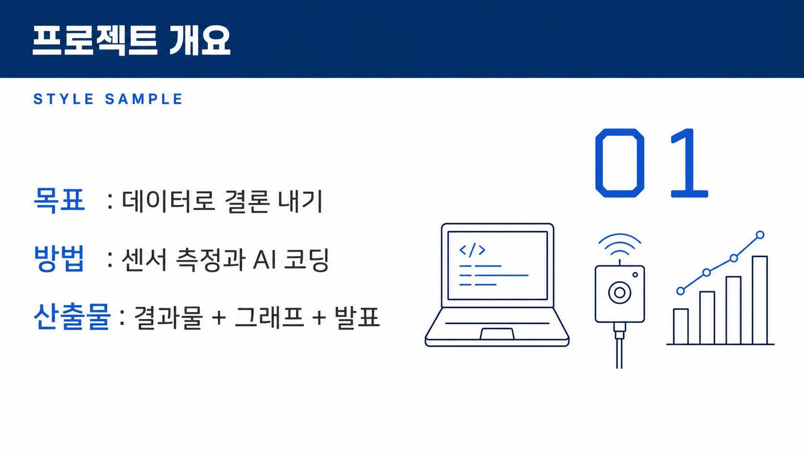

---

### 2. 미니멀 모노 — `ppt-steady-02`

화이트/차콜 단색 + 포인트 1색. 여백 극대화.  
**최적 용도**: 선언·비전·챕터 표지, 한 줄 결론

<details><summary><b>색감·타이포 상세</b> (펼치기)</summary>

| 항목 | 내용 |
|---|---|
| 색감 | 순백(#FFFFFF) 배경에 차콜(#222)과 미드그레이(#8A8A8A) 단색만 사용, 포인트는 오직 머스터드(#E1A100) 한 색. 채도 높은 색은 전부 배제하고 여백을 화면의 절반 이상으로 극대화. 구분선은 머리카락처럼 얇은 0.5~1px 미드그레이 실선, 포인트가 필요한 곳(라벨·숫자·강조 키워드)에만 머스터드를 아주 작은 면적으로 절제해서 찍는다. 그림자·그라데이션·질감 없이 완전 평면, 절제되고 집중되는 톤. |
| 한글 폰트 | 깔끔한 지오메트릭 산세리프. 제목은 중간~약간 굵은 굵기(medium~semibold)에 자간을 살짝 넓혀(+2~4%) 여백과 호흡을 맞추고, 본문·부제는 얇은 굵기(light~regular)로 굵기 대비만으로 위계를 만든다. 획 두께 변화가 거의 없는 저대비, 곧고 단정한 세로획, 닫힌 인상 없이 트인 속공간. 세리프·장식 없음. 명조 인상은 쓰지 않고 오직 굵기와 넓은 자간, 큰 크기 위계로 절제된 인상을 만든다. |
| 영문 폰트 | 두 갈래로 운용한다. (1) 킥커·라벨·페이지 번호는 모노스페이스 느낌의 등폭 대문자 소형(ALL CAPS), 자간을 크게 벌려(+8~12%) '모노'의 정체성을 시각적으로 드러낸다. (2) 큰 숫자·연도·수치는 얇은~중간 굵기 지오메트릭 그로테스크로, 세리프 없이 기하학적이고 균질한 획. 전체적으로 저대비·무장식, 대문자와 넓은 트래킹이 미니멀·기계적 인상을 담당한다. |
| 한글·영문 배열 | 한글 굵은 제목이 위계의 정점 — 화면 좌측 또는 상단에 큼직하게, 넓은 자간으로. 그 바로 위 또는 아래에 머스터드 색 영문 등폭 소형 캡스 라벨(예: "SECTION 02", "KEYWORD")을 킥커로 얹어 대비를 만든다. 한글은 크고 굵게(내용), 영문은 작고 넓게 벌린 대문자(태그·인덱스) — 크기·굵기·색이 모두 반대로 가서 대비가 선명하다. 둘 사이는 얇은 머스터드 또는 미드그레이 구분선 한 줄. 본문 한글은 라이트 굵기로 물러나고, 수치·연도만 영문 그로테스크가 크게 받는다. 정렬은 좌측 정렬 기준, 요소 사이 여백을 과감히 비운다. |

</details>

**비주얼 애셋 규격**

| 요소 | 규격 |
|---|---|
| 사진 | 흑백 사진 한 장을 크게 쓰거나, 아예 쓰지 않는다. 사진에 색을 입히지 않는다. |
| 아이콘·일러스트 | 아이콘을 최소화한다. 쓸 경우 얇은 차콜 라인으로 아주 작게, 장식이 아니라 표식으로만. |
| 도표·차트 | 축 없는 미니멀 차트 — 그리드선 제거, 데이터 계열 1개, 값 라벨 2~3개만. 머스터드는 단 하나의 강조점에만 찍는다. |
| 3D | 사용하지 않는다. |
| 배치 | 화면의 절반 이상을 비운다. 비주얼은 한쪽에만 놓고 반대편은 완전히 여백으로 둔다. |
| 모드 B 텍스트 안전 영역 | 좌측 또는 상단 (화면 과반이 여백) |

**조판 리듬**

| 항목 | 값 |
|---|---|
| 슬라이드당 메시지 | 1개 (엄수) |
| 텍스트 상한 | 60자 |
| 표 상한 | 4행 (표 자체를 지양) |
| 권장 레이아웃 | 초대형 한글 제목 + 머스터드 영문 캡스 킥커, 나머지는 여백 |

**주입 블록** — 아래 전문을 프롬프트 맨 앞에 그대로 붙인다 (`[1]+[2]` 합본)

```text
스타일: 순백 배경에 차콜(#222)과 미드그레이 단색, 포인트는 오직 머스터드(#E1A100) 한 색만 쓰는 극단적 미니멀 편집 디자인. 화면 절반 이상을 빈 여백으로 두고, 요소를 좌측 정렬로 성기게 배치한다. 그림자·그라데이션·질감 없는 완전 평면, 구분은 머리카락처럼 얇은 실선 한 줄로만. 타이포는 한글 지오메트릭 산세리프 — 제목은 중간~약간 굵은 굵기에 자간을 넓혀 크고 단정하게, 본문·부제는 얇은 굵기로 물러나 굵기 대비만으로 위계를 만든다(세리프·장식 없음, 저대비의 곧은 획). 영문은 모노스페이스 느낌 등폭 대문자를 아주 작게, 자간을 크게 벌려 머스터드 색 킥커·라벨·페이지 번호로만 얹고, 큰 숫자·연도는 얇은 지오메트릭 그로테스크로 받는다. 큰 한글 제목(내용) 대 작고 넓게 벌린 영문 대문자 라벨(인덱스)의 대비가 핵심. 절제되고 집중된, 기계적이면서 고요한 인상.

비주얼은 극단적으로 절제한다. 사진은 흑백 한 장을 크게 쓰거나 아예 넣지 않으며 절대 색을 입히지 않는다. 아이콘은 최소화하고, 쓰더라도 얇은 차콜 라인으로 아주 작게 표식처럼만 넣는다. 차트는 축과 그리드선을 지우고 데이터 계열 하나에 값 라벨 두세 개만 남긴 미니멀 형태로, 머스터드는 단 하나의 강조점에만 찍는다. 3D·그림자·질감은 쓰지 않는다. 화면의 절반 이상을 빈 여백으로 두고 비주얼은 한쪽에만 배치한다.
```

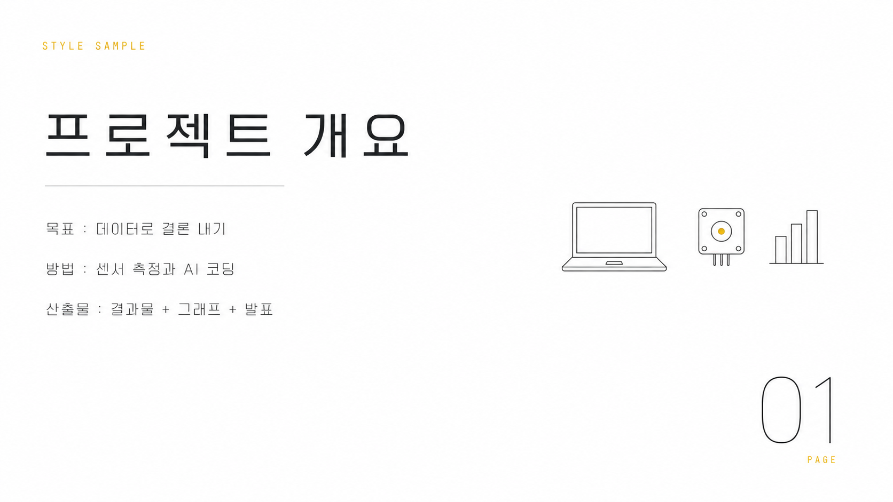

---

### 3. 에디토리얼 세리프 — `ppt-steady-03`

아이보리 배경 + 세리프 제목. 잡지형 그리드.  
**최적 용도**: 브랜드 스토리, 리서치 리포트, 인터뷰·사례

<details><summary><b>색감·타이포 상세</b> (펼치기)</summary>

| 항목 | 내용 |
|---|---|
| 색감 | 따뜻한 아이보리(#F6F1E7) 무광 매트 종이 배경에 잉크빛 웜 차콜(#2B2A26) 본문. 딥그린(#1F4D3A)은 괘선·스몰캡스 라벨·핵심 숫자에만 절제해 쓰는 유일한 포인트색. 그래픽 처리는 머리카락처럼 얇은 헤어라인 괘선과 넉넉한 여백으로 짜는 잡지형 멀티컬럼 그리드 — 채도 낮고 정제된, 지면 같은 대비. |
| 한글 폰트 | 세리프(명조) 파일에 의존하지 않고 정갈한 산세리프로 렌더하되, 편집 지면 인상을 자간과 굵기로 만든다: 자간을 넓게 개방(트래킹 열기)해 우아하고 차분하게, 획은 얇고 균일하게, 폭은 표준~약간 좁게, 대비는 낮게. 제목 한글은 미디엄, 본문 한글은 레귤러로 위계 구분. 장식 없이 지적이고 절제된 인상. |
| 영문 폰트 | 고대비 디스플레이 세리프 — 얇은 헤어라인 세리프와 굵은 세로획의 뚜렷한 두께 대비로 클래식한 잡지 마스트헤드 느낌. 헤드라인은 대형에 타이트한 자간, 부분 이탤릭 강조 가능. 라벨은 소형 대문자(스몰캡스)로 자간을 크게 벌려 딥그린. 숫자(페이지·통계·피규어)는 같은 세리프로 크게, 딥그린으로 강조. |
| 한글·영문 배열 | 영문 대형 세리프 디스플레이가 시각 정점(마스트헤드/피처 타이틀)을 잡고, 그 아래 한 급 작은 미디엄 굵기·넓은 자간의 한글 제목이 병기된다. 상단 키커는 영문 스몰캡스 라벨(자간 크게 벌린 딥그린)이 헤어라인 괘선과 함께. 본문은 한글 레귤러 산세리프 멀티컬럼, 큰 딥그린 세리프 숫자가 지면 리듬을 잡는다. 역할 분담: 영문=세리프·격식·대비, 한글=차분한 가독 본문. |

</details>

**비주얼 애셋 규격**

| 요소 | 규격 |
|---|---|
| 사진 | 사진을 적극 쓴다. **흑백으로 한정**하고 화면의 1/2~2/3 판형으로 크게, 헤어라인 캡션을 붙인다. (딥그린은 비사진 그래픽의 포인트색이므로 사진에 듀오톤으로 입히지 않는다.) |
| 아이콘·일러스트 | 아이콘 대신 얇은 괘선과 드롭캡으로 리듬을 만든다. 아이콘을 쓰면 세밀한 라인으로. |
| 도표·차트 | 신문 인포그래픽 룩 — 얇은 괘선, 딥그린 단색, 큰 세리프 숫자, 범례는 영문 스몰캡스. |
| 3D | 사용하지 않는다. |
| 배치 | 멀티컬럼 그리드에 정렬. 사진은 컬럼 폭에 맞춰 재단하고 가장자리까지 흘려도(bleed) 좋다. |
| 모드 B 텍스트 안전 영역 | 사진이 없는 컬럼 전체 |

**조판 리듬**

| 항목 | 값 |
|---|---|
| 슬라이드당 메시지 | 1~2개 |
| 텍스트 상한 | 320자 (기사형 허용) |
| 표 상한 | 6행 |
| 권장 레이아웃 | 영문 대형 세리프 헤드라인 + 한글 부제, 2~3단 컬럼 본문, 큰 세리프 숫자 |

**주입 블록** — 아래 전문을 프롬프트 맨 앞에 그대로 붙인다 (`[1]+[2]` 합본)

```text
스타일: 따뜻한 아이보리(#F6F1E7) 매트 종이 배경의 잡지형 에디토리얼 레이아웃. 머리카락처럼 얇은 헤어라인 괘선과 넉넉한 여백으로 멀티컬럼 그리드를 구성하고, 딥그린(#1F4D3A)은 괘선·스몰캡스 라벨·핵심 숫자에만 절제해 포인트로 쓴다. 본문 텍스트는 잉크빛 웜 차콜(#2B2A26). 영문과 숫자는 고대비 디스플레이 세리프 — 얇은 헤어라인 세리프와 굵은 세로획의 뚜렷한 두께 대비로 클래식한 잡지 마스트헤드 인상, 헤드라인은 대형에 타이트한 자간, 부분 이탤릭 강조. 한글은 세리프 폰트에 의존하지 않고 정갈한 산세리프로 렌더하되, 자간을 넓게 열고 획을 얇고 균일하게, 폭은 표준~약간 좁게 하여 편집 지면 특유의 차분하고 우아한 인상을 만든다. 배열은 영문 대형 세리프 디스플레이가 시각 정점을 잡고, 그 아래 한 급 작은 미디엄 굵기의 넓은 자간 한글 제목이 병기되며, 상단에는 영문 스몰캡스 라벨(자간을 크게 벌린 딥그린)이 헤어라인 괘선과 함께 키커로 놓인다. 본문은 한글 레귤러 산세리프 멀티컬럼, 큰 딥그린 세리프 숫자가 지면의 리듬을 만든다.

사진을 주요 비주얼로 적극 사용한다. 모든 사진은 흑백으로 통일하고(딥그린은 사진이 아니라 괘선·라벨·숫자에만 쓴다) 화면의 절반에서 3분의 2에 이르는 큰 판형으로 배치하며, 얇은 헤어라인 캡션을 붙인다. 아이콘 대신 얇은 괘선과 드롭캡으로 지면의 리듬을 만든다. 차트는 신문 인포그래픽처럼 얇은 괘선과 딥그린 단색, 큰 세리프 숫자, 영문 스몰캡스 범례로 구성한다. 3D·광택은 쓰지 않는다. 사진과 차트는 멀티컬럼 그리드에 정렬하고 가장자리까지 흘려도 좋다.
```

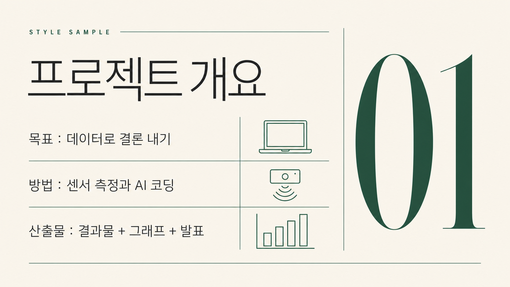

---

### 4. 그리드 인포 — `ppt-steady-04`

밝은 회색 + 카드 그리드. 표·수치 강조(아두이노 데크 계열).  
**최적 용도**: 지표·밸런스·명세·비교표 등 데이터 중심 문서

<details><summary><b>색감·타이포 상세</b> (펼치기)</summary>

| 항목 | 내용 |
|---|---|
| 색감 | 아주 옅은 회색(#F7F9FA) 배경에 청록(#00979D) 포인트, 주황(#F2994A) 보조를 쓰는 플랫 벡터 데이터 톤. 상단 폭 넓은 청록 제목 바(흰 텍스트), 아래는 카드 그리드와 표 중심 레이아웃. 구분선은 얇은 회색(#E3E8EA), 그림자는 거의 없이 평평하게. 청록은 제목바·표 헤더·핵심 수치에, 주황은 하이라이트·증감 표시·소량 강조에만 절제해서 사용. 넉넉한 여백으로 정보 밀도를 낮게 유지. |
| 한글 폰트 | 휴머니스트 산세리프 인상, 세리프 없음. 제목은 굵게(bold~semibold), 소제목은 중간(medium), 본문·표·캡션은 regular. 글자폭 표준~약간 넓게, 자간은 0에 가깝게(제목만 아주 살짝 좁게), 획 굵기 균일하고 속공간이 열려 작은 표 글자에서도 또렷. 크기 위계 3단(대 제목 / 중 항목명 / 소 표·캡션)으로 명확히 구분. |
| 영문 폰트 | 지오메트릭~네오그로테스크 산세리프, 세리프 없음. 라벨·섹션 태그·표 헤더의 영문은 전부 대문자(스몰캡스 느낌), 넓은 자간, 얇은~중간 굵기. 숫자는 고정폭 라이닝 숫자(tabular lining figures)로 표에서 자릿수·소수점이 세로로 정렬되게. 제목을 보조하는 영문은 중간 굵기, 단위·범례는 소형. |
| 한글·영문 배열 | 한글이 주 정보(제목·항목명·본문·표 텍스트), 영문은 보조 라벨과 숫자 담당. 상단 청록 바 안에 흰색 굵은 한글 제목을 두고, 그 위 또는 왼쪽에 영문 소형 대문자 카테고리 라벨(넓은 자간)을 킥커로 얹는다. 카드·표 헤더는 영문 스몰캡스 라벨(청록) + 한글 중간굵기 항목명 조합. 핵심 수치는 영문 tabular 숫자를 크게, 단위는 작은 한글로 붙인다. 대비 원리는 '큰 한글 제목 vs 작고 자간 넓은 영문 캡스' — 크기·굵기·대소문자 3중 대비로 위계를 만든다. |

</details>

**비주얼 애셋 규격**

| 요소 | 규격 |
|---|---|
| 사진 | 실사 사진 대신 플랫 벡터 일러스트를 쓴다. 사진이 필요하면 아주 작게 보조로만. |
| 아이콘·일러스트 | 플랫 필 아이콘, 청록 단색에 주황 포인트 하나. 카드·표 헤더에 소형으로 붙인다. |
| 도표·차트 | 표와 같은 그리드에 정렬된 막대·라인·도넛. 청록이 기본, 주황은 강조 계열 하나에만. 축 이름 필수, 값은 고정폭 숫자. |
| 3D | 사용하지 않는다. 평면을 유지해야 표와 시각적으로 어울린다. |
| 배치 | 카드 그리드 안에 배치. 좌측 텍스트·표 / 우측 차트가 기본, 상하 2단도 가능. |
| 모드 B 텍스트 안전 영역 | 좌측 55% 및 하단 배너 |

**조판 리듬**

| 항목 | 값 |
|---|---|
| 슬라이드당 메시지 | 1~2개 |
| 텍스트 상한 | 260자 |
| 표 상한 | 8행 × 6열 |
| 권장 레이아웃 | 상단 청록 제목 바 + 카드 그리드 / 표 + 차트 조합 |

**주입 블록** — 아래 전문을 프롬프트 맨 앞에 그대로 붙인다 (`[1]+[2]` 합본)

```text
스타일: 아주 옅은 회색(#F7F9FA) 배경의 플랫 벡터 데이터 슬라이드. 상단에 폭 넓은 청록(#00979D) 제목 바를 두고 그 안에 흰색 굵은 한글 제목(휴머니스트 산세리프, semibold, 자간 살짝 좁게)을 넣고, 제목 위에 영문 소형 대문자 라벨을 넓은 자간으로 킥커처럼 얹는다. 본문은 카드 그리드와 표 중심으로 구성하되 얇은 회색(#E3E8EA) 구분선과 넉넉한 여백으로 밀도를 낮춘다. 표·카드 헤더는 영문 스몰캡스 라벨(청록)과 한글 중간굵기 항목명을 짝지어 쓰고, 수치는 고정폭 라이닝 숫자로 자릿수가 세로로 정렬되게 크게, 단위는 작은 한글로 붙인다. 한글은 세리프 없이 획이 균일하고 속공간이 열린 산세리프로 작은 글자도 또렷하게, 영문은 지오메트릭·네오그로테스크 산세리프로 라벨은 대문자·숫자는 tabular. 청록은 제목바·헤더·핵심 수치에, 주황(#F2994A)은 증감 표시나 하이라이트 같은 소량 강조에만 절제해 쓰고 그림자는 거의 없이 평평하게 유지한다. 위계는 큰 한글 제목과 작고 자간 넓은 영문 캡스의 크기·굵기·대소문자 3중 대비로 만든다.

비주얼은 평면을 유지한 채 표와 같은 그리드에 정렬한다. 실사 사진 대신 플랫 벡터 일러스트를 쓰고, 아이콘은 청록 단색 플랫 필에 주황 포인트를 하나만 섞어 카드·표 헤더에 소형으로 붙인다. 차트는 표와 같은 정렬선을 공유하는 막대·라인·도넛으로, 청록을 기본색으로 하고 주황은 강조 계열 하나에만 쓴다. 축 이름을 반드시 표기하고 값은 고정폭 숫자로 정렬한다. 3D·그림자·광택은 쓰지 않는다. 좌측에 텍스트와 표, 우측에 차트를 두는 배치를 기본으로 한다.
```

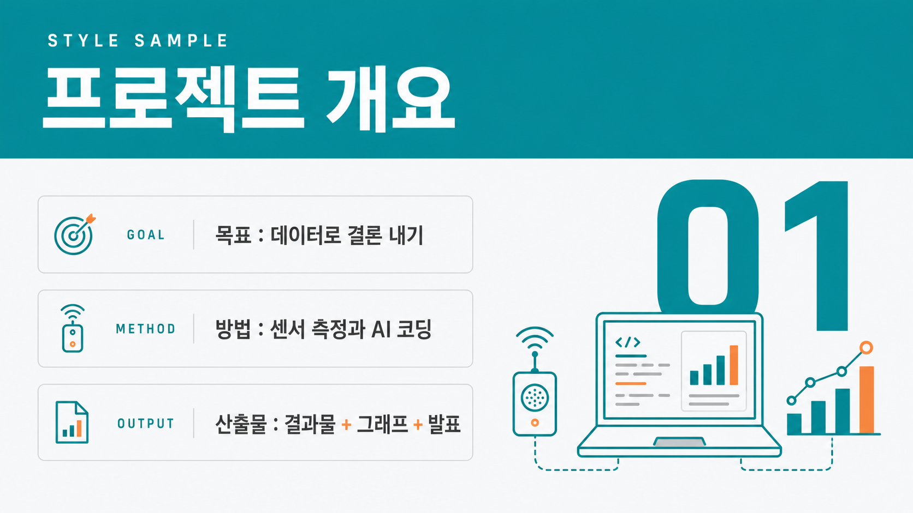

---

### 5. 어스 뉴트럴 — `ppt-steady-05`

베이지·세이지·테라코타. 부드러운 대비.  
**최적 용도**: ESG·환경·인문·교육 철학, 브랜드 가치

<details><summary><b>색감·타이포 상세</b> (펼치기)</summary>

| 항목 | 내용 |
|---|---|
| 색감 | 웜베이지(#EFE7DA) 배경에 세이지그린(#8AA07C)과 테라코타(#C1704A)를 포인트로, 머드브라운(#5B4A3A)을 본문 텍스트색으로 쓰는 친환경·인문 톤. 부드러운 저대비, 채도 낮은 매트 마감. 손으로 찢은 종이결·잎사귀 실루엣·둥근 유기적 형태를 여백에 은은히 배치하고, 그래픽은 딱딱한 직선보다 완만한 곡선과 자연물 실루엣으로 처리. |
| 한글 폰트 | 획대비가 낮고 속공간이 열린 휴머니스트 산세리프. 터미널이 약간 둥글어 따뜻한 인상. 제목은 중간 굵기(medium/semibold)에 넉넉한 자간과 여유로운 행간으로 차분·유기적 리듬을, 본문은 라이트~레귤러 굵기로 담백하게. 폭은 표준~살짝 넓게, 기계적 지오메트릭 느낌은 피하고 인간적인 곡선을 유지. (참고 힌트: 산돌 고딕네오·본고딕 계열의 부드러운 휴머니스트 감. 폰트명 의존 금지, 위 시각 속성으로 렌더.) |
| 영문 폰트 | 따뜻한 올드스타일/휴머니스트 세리프. 브래킷(둥근 목) 세리프, 중간 정도의 획대비, 손글씨에서 온 듯한 캘리그래픽 온기. 헤드라인은 첫 글자만 대문자인 타이틀케이스로 크게. 라벨용은 전부 대문자 소형 캡스(small caps)에 넓은 자간. 숫자는 올드스타일(텍스트) 숫자로 베이스라인이 오르내려 유기적 리듬. (참고 힌트: Garamond·Freight Text 같은 따뜻한 북세리프 감. 폰트명 의존 금지, 위 속성으로 렌더.) |
| 한글·영문 배열 | 영문 세리프를 대형 디스플레이 헤드라인으로 화면의 초점에 두고(타이틀케이스, 중간 굵기), 그 아래 한글 부제를 헤드라인의 약 50~60% 크기로 중간 굵기 휴머니스트 산세리프에 넓은 자간으로 얹는다. 헤드라인 위에는 테라코타색 영문 소형 캡스(전부 대문자·넓은 자간)로 짧은 아이브로 라벨. 세리프(영문·숫자) vs 산세리프(한글), 큰 크기 vs 중간 크기, 하이컨트라스트 vs 넉넉한 자간의 대비로 위계를 만든다. 정렬은 왼쪽 정렬 또는 약간 비대칭의 여백 넉넉한 구성. |

</details>

**비주얼 애셋 규격**

| 요소 | 규격 |
|---|---|
| 사진 | 자연물·소재 질감 사진(종이·리넨·잎·흙)을 저채도로. 인물은 따뜻한 자연광에서. |
| 아이콘·일러스트 | 손그림 느낌의 유기적 라인 아이콘. 잎·물결·씨앗 모티프. |
| 도표·차트 | 곡선형 부드러운 차트, 세이지그린과 테라코타 2색, 그리드선 최소. 막대 끝은 둥글게. |
| 3D | 사용하지 않는다. 대신 종이 결·찢은 가장자리 텍스처로 촉감을 준다. |
| 배치 | 비대칭 여백. 사진은 유기적 블롭 형태로 마스킹해 재단한다. |
| 모드 B 텍스트 안전 영역 | 블롭 이미지 반대편 (비대칭) |

**조판 리듬**

| 항목 | 값 |
|---|---|
| 슬라이드당 메시지 | 1~2개 |
| 텍스트 상한 | 240자 (문장형 허용) |
| 표 상한 | 6행 |
| 권장 레이아웃 | 비대칭 2분할, 유기적 블롭 마스크 이미지 + 여유로운 본문 |

**주입 블록** — 아래 전문을 프롬프트 맨 앞에 그대로 붙인다 (`[1]+[2]` 합본)

```text
스타일: 웜베이지(#EFE7DA) 배경에 세이지그린(#8AA07C)·테라코타(#C1704A) 포인트와 머드브라운(#5B4A3A) 본문색을 얹은 유기적·친환경 인문 톤, 부드러운 저대비와 매트한 마감, 손으로 찢은 종이결과 잎사귀 실루엣 같은 완만한 곡선 형태를 여백에 은은히 배치. 타이포는 영문 대형 헤드라인을 따뜻한 올드스타일 세리프(중간 굵기, 둥근 브래킷 세리프, 중간 정도의 획대비, 첫 글자만 대문자인 타이틀케이스)로 크게 앉히고, 그 아래 한글 부제는 획대비 낮고 속공간이 열린 휴머니스트 산세리프를 중간 굵기·넉넉한 자간·여유로운 행간으로 차분하게 배치한다. 헤드라인 위에는 테라코타색 영문 소형 캡스(전부 대문자, 넓은 자간)로 짧은 아이브로 라벨을 얹고, 숫자는 올드스타일(텍스트) 숫자로 베이스라인이 오르내리는 유기적 리듬을 살린다. 전체적으로 왼쪽 정렬 혹은 약간 비대칭의 여백 넉넉한 구성, 은은하고 따뜻한 자연물 감성.

비주얼은 자연의 촉감을 살린다. 사진은 종이·리넨·잎·흙 같은 소재 질감이나 따뜻한 자연광의 인물을 저채도로 쓰고, 유기적인 블롭 형태로 마스킹해 재단한다. 아이콘은 손그림 느낌의 유기적 라인으로 잎·물결·씨앗 모티프를 쓴다. 차트는 곡선형으로 부드럽게, 세이지그린과 테라코타 2색만 사용하고 그리드선은 최소화하며 막대 끝은 둥글게 처리한다. 3D·광택 대신 종이 결과 찢은 가장자리 텍스처로 질감을 준다. 여백은 비대칭으로 두어 느슨한 리듬을 만든다.
```

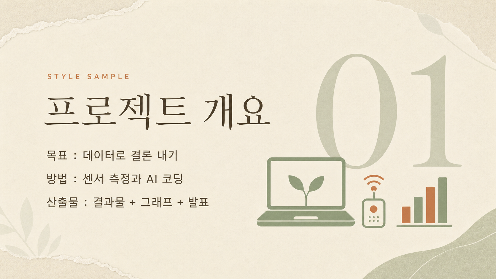

---

## 베스트셀러

### 6. 틸&오렌지 플랫 — `ppt-best-01`

옅은 회색+강한 청록/주황, 마케팅 임팩트 헤드라인.  
**최적 용도**: 캠페인·제안 요약, 핵심 메시지 전달

<details><summary><b>색감·타이포 상세</b> (펼치기)</summary>

| 항목 | 내용 |
|---|---|
| 색감 | 옅은 쿨 그레이 배경(#EDF1F2, 살짝 청록기 도는 밝은 회색)에 채도 높은 청록(#0FB6AE)과 선명한 주황(#FF6A2C)을 두 주역으로 대비시킨 플랫 벡터 팔레트. 그라디언트·그림자·질감 없이 100% 순색 면으로만 채우는 플랫 처리. 깊이·본문 잉크는 짙은 청록(#0B6E6A)과 차콜 그린(#16292C)으로 잡고, 카드·여백은 순백(#FFFFFF)으로 비운다. 청록이 면적 주도, 주황은 CTA·숫자·강조에만 쏘는 포인트 컬러. 넓은 네거티브 스페이스로 색면 사이에 호흡을 준다. |
| 한글 폰트 | 굵은(엑스트라볼드~블랙) 넓은-폭 지오메트릭 한글 산세리프. 큰 x-높이, 굵기 편차 없는 균일한 스트로크, 둥근 기하 골격에 플랫한(장식 없는) 종단. 헤드라인은 자간을 타이트하게 좁혀 덩어리감 있는 큰 블록으로 화면을 압도. 부제는 미디엄 굵기에 정상 자간으로 차분하게 내려앉힘. 명조/세리프 인상은 배제하고 순수 산세리프의 마케팅 톤을 유지 — 한글은 굵기 위계로만 위상 차이를 만든다. |
| 영문 폰트 | 지오메트릭 그로테스크 산세리프(세리프 없음, 플랫 마케팅에 맞춘 정직한 선택). 아이브로·라벨은 전부 올대문자(all-caps)에 넓은 자간(레터스페이싱/트래킹)을 준 소형 캡스로, 얇거나 미디엄 굵기. 숫자·통계·퍼센트는 같은 지오메트릭 계열의 볼드로 크게 키운 디스플레이 뉘앙스. 저·고 대비 없이 균일 굵기, 열린 자형, 단정한 기하 곡선. |
| 한글·영문 배열 | 위→아래 3단 위계. (1) 최상단 영문 올대문자 아이브로 라벨(소형, 넓은 트래킹, 청록 또는 주황) — 작지만 존재감. (2) 그 아래 한글 엑스트라볼드 대형 헤드라인이 화면을 압도(가장 큰 크기, 타이트 자간, 차콜 잉크). (3) 한글 미디엄 부제가 정상 자간으로 뒤를 받침. 통계·수치는 영문 볼드 지오메트릭을 헤드라인급으로 키워 주황으로 그래픽 강조. 큰 한글 헤드라인 ↔ 작은 영문 캡스 라벨의 크기·굵기 대비가 핵심 리듬. 좌측 정렬 기본, 색면과 여백으로 마케팅 임팩트. |

</details>

**비주얼 애셋 규격**

| 요소 | 규격 |
|---|---|
| 사진 | 플랫 벡터 일러스트를 우선한다. 사진을 쓰면 청록·주황 그레이딩으로 통일. |
| 아이콘·일러스트 | 굵은 플랫 필 아이콘을 크게. 카드 상단에 시선을 먼저 잡도록 배치. |
| 도표·차트 | 굵은 막대와 큰 값 라벨. 축은 최소화하고 강조 계열 하나만 주황으로. |
| 3D | 지양한다. 평면의 대담함이 이 스타일의 핵심이다. |
| 배치 | 좌측 큰 헤드라인 / 우측 대담하게 큰 비주얼. 비주얼을 겁내지 말고 크게 쓴다. |
| 모드 B 텍스트 안전 영역 | 좌측 50% |

**조판 리듬**

| 항목 | 값 |
|---|---|
| 슬라이드당 메시지 | 1개 |
| 텍스트 상한 | 140자 |
| 표 상한 | 6행 (표보다 카드 선호) |
| 권장 레이아웃 | 초대형 한글 헤드라인 + 큰 단일 비주얼 |

**주입 블록** — 아래 전문을 프롬프트 맨 앞에 그대로 붙인다 (`[1]+[2]` 합본)

```text
스타일: 옅은 쿨 그레이(#EDF1F2) 배경 위에 채도 높은 청록(#0FB6AE)과 선명한 주황(#FF6A2C)을 주역으로 쓰는 플랫 벡터 마케팅 레이아웃. 그라디언트·그림자·질감 없이 순색 면으로만 채우고, 순백 카드와 넓은 여백으로 호흡을 준다. 깊이와 본문 잉크는 짙은 청록(#0B6E6A)과 차콜 그린(#16292C)으로 잡고, 청록이 면적을 주도하며 주황은 CTA·숫자·강조에만 쏜다. 최상단에는 영문 올대문자 아이브로 라벨을 소형 지오메트릭 산세리프에 넓은 자간으로 청록 포인트를 준다. 그 아래 헤드라인은 굵은(엑스트라볼드) 넓은-폭 지오메트릭 한글 산세리프로 자간을 타이트하게 좁혀 화면을 압도할 만큼 크게. 부제는 중간 굵기 한글 산세리프에 정상 자간으로 차분하게 받친다. 숫자·통계·퍼센트는 영문 볼드 지오메트릭 산세리프를 크게 키워 주황으로 그래픽 강조. 세리프는 전혀 쓰지 않고 전부 깔끔한 산세리프로 통일하며, 큰 타이포와 여백 리듬, 강한 청록·주황 색면 대비로 마케팅 임팩트를 만든다.

비주얼을 대담하게 크게 쓴다. 실사 사진보다 플랫 벡터 일러스트를 우선하고, 사진을 쓸 경우 청록과 주황 그레이딩으로 톤을 통일한다. 아이콘은 굵은 플랫 필로 크게 만들어 카드 상단에서 시선을 먼저 잡게 한다. 차트는 굵은 막대와 큰 값 라벨 중심으로 단순화하고 축은 최소화하며 강조 계열 하나만 주황으로 칠한다. 3D·광택은 쓰지 않는다. 좌측에 초대형 한글 헤드라인, 우측에 큰 단일 비주얼을 두는 대비 구도를 기본으로 한다.
```

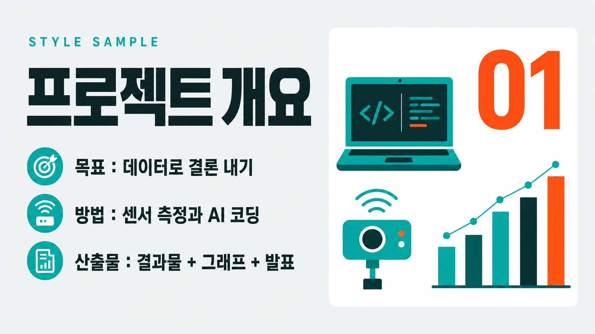

---

### 7. 바이브런트 듀오톤 — `ppt-best-02`

코발트×애시드옐로 듀오톤, 초대형 숫자.  
**최적 용도**: 임팩트 있는 수치 공개, 오프닝·클로징

<details><summary><b>색감·타이포 상세</b> (펼치기)</summary>

| 항목 | 내용 |
|---|---|
| 색감 | 일렉트릭 코발트블루(#1D34E8) × 애시드 옐로(#FFE600) 하드 2색 듀오톤. 보조로 near-black 잉크(#0A0E2A)와 오프화이트(#F5F5EF)만 사용하고 그라데이션은 배제, 채도는 최대로. 사진은 두 색으로 매핑한 듀오톤 처리(그림자=코발트, 하이라이트=옐로)에 미세 하프톤 그레인. 슬라이드 블록마다 바탕색을 코발트↔옐로로 교차하고 타이포는 반대색으로 녹아웃(옐로 바탕엔 코발트/블랙, 코발트 바탕엔 옐로/화이트). |
| 한글 폰트 | 한글은 블랙~엑스트라볼드 산세리프. 폭이 좁고 세로로 긴 인상에 자간을 바짝 좁혀 글자가 한 덩어리처럼 뭉치는 헤드라인. 세리프 없음. 부제·본문은 미디엄 굵기 산세리프로 굵기와 크기를 확 낮춰 위계를 급강하. |
| 영문 폰트 | 영문·숫자는 굵은 그로테스크/지오메트릭 산세리프, 세리프 없음. 헤드라인과 특히 숫자 글리프는 초대형 블랙 웨이트에 약간 넓은 폭으로 화면을 지배. 소형 라벨(kicker)은 전부 대문자(all-caps)에 자간을 크게 벌려 정돈된 대비. 큰 숫자가 주인공. |
| 한글·영문 배열 | 거대한 영문 숫자(듀오톤 강조색)를 좌상단 또는 중앙 시각 앵커로 최상단 위계에 둔다. 그 옆·아래에 한글 블랙 헤드라인을 숫자의 40~50% 크기로 스택. 맨 위엔 소형 영문 all-caps 라벨을 넓은 자간으로 얹는다. 한글=굵고 좁고 밀집, 영문·숫자=더 크고 넓고 지배적. 두 언어 사이 크기 점프를 극단적으로 벌려 강한 대비 임팩트를 만든다. |

</details>

**비주얼 애셋 규격**

| 요소 | 규격 |
|---|---|
| 사진 | 듀오톤 사진을 적극 쓴다. 코발트와 애시드옐로 2색으로 매핑, 대비를 강하게, 전면 배경으로도 사용. |
| 아이콘·일러스트 | 2색 실루엣 아이콘. 하프톤 도트 텍스처를 얹어도 좋다. |
| 도표·차트 | 복잡한 차트를 피하고 초대형 숫자 + 미니 스파크라인으로 대체한다. |
| 3D | 지양한다. |
| 배치 | 사진을 전면 또는 반면으로 크게 깔고 그 위에 초대형 숫자·헤드라인을 얹는다. |
| 모드 B 텍스트 안전 영역 | 중앙 오버레이 — 사진 위에 얹되 명도 대비 확보 |

**조판 리듬**

| 항목 | 값 |
|---|---|
| 슬라이드당 메시지 | 1개 (숫자 1 + 문장 1) |
| 텍스트 상한 | 80자 |
| 표 상한 | 표 지양 |
| 권장 레이아웃 | 듀오톤 전면 이미지 + 초대형 숫자 오버레이 |

**주입 블록** — 아래 전문을 프롬프트 맨 앞에 그대로 붙인다 (`[1]+[2]` 합본)

```text
스타일: 강렬한 2색 듀오톤 편집 포스터. 배경은 일렉트릭 코발트블루(#1D34E8)와 애시드 옐로(#FFE600)를 하드하게 대비시키고 보조로 near-black 잉크(#0A0E2A)·오프화이트(#F5F5EF)만 쓴다, 그라데이션 없이 채도 최대. 사진은 두 색으로 매핑한 듀오톤(그림자=코발트, 하이라이트=옐로)에 미세 하프톤 그레인. 타이포는 초굵게 밀어붙인다: 화면을 지배하는 초대형 영문 숫자와 헤드라인은 세리프 없는 블랙 웨이트의 넓은 그로테스크 산세리프로, 옐로 바탕엔 코발트/블랙, 코발트 바탕엔 옐로/화이트로 녹아웃. 한글 헤드라인은 폭이 좁고 세로로 긴 블랙~엑스트라볼드 산세리프에 자간을 바짝 좁혀 한 덩어리로 뭉치고, 부제는 미디엄 굵기 산세리프로 위계를 확 낮춘다. 최상단엔 전부 대문자에 자간을 크게 벌린 소형 영문 라벨. 거대한 숫자를 앵커로 두고 그 옆·아래에 한글 굵은 제목을 절반 크기로 스택해 극단적 크기 위계와 강한 대비 임팩트를 완성한다.

듀오톤 사진이 화면의 주역이다. 모든 사진을 코발트블루와 애시드옐로 2색으로 매핑해 대비를 강하게 만들고, 전면 또는 반면 배경으로 크게 깐 뒤 그 위에 초대형 숫자와 헤드라인을 얹는다. 아이콘은 같은 2색의 실루엣으로, 하프톤 도트 텍스처를 얹어도 좋다. 차트는 복잡하게 만들지 말고 초대형 숫자와 미니 스파크라인으로 대체한다. 3D·광택은 쓰지 않는다. 표는 사용하지 않고 숫자 하나와 문장 하나로 화면을 지배하게 한다.
```

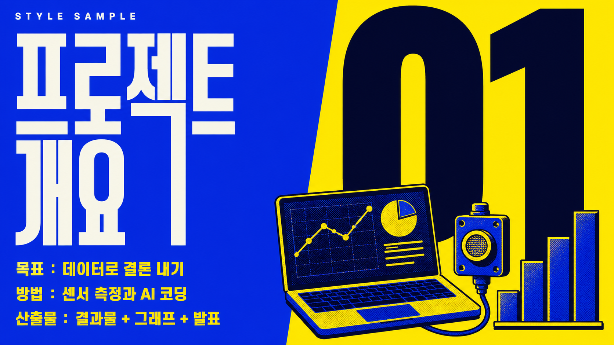

---

### 8. 소프트 파스텔 카드 — `ppt-best-03`

파스텔 배경, 둥근 카드, 친근한 교육 톤.  
**최적 용도**: 교육·서비스 소개, 온보딩, 기능 설명

<details><summary><b>색감·타이포 상세</b> (펼치기)</summary>

| 항목 | 내용 |
|---|---|
| 색감 | 파스텔 배경 팔레트 — 베이스는 아주 옅은 라벤더빛 화이트(#F6F4FB), 카드는 순백(#FFFFFF)에 12~20px 둥근 모서리와 넓게 퍼진 저채도 소프트 그림자(불투명도 8~12%, 검은 테두리 없음). 포인트 3색은 소프트 민트(#B6E3D4)·라이트 라벤더(#D4C7F0)·웜 피치(#FFCDB2)를 채도 20~30% 수준으로 낮춰 카드 배경·태그·아이콘 자리에 번갈아 순환. 텍스트는 순검정 대신 딥 슬레이트(#41414F), 보조 텍스트는 뮤트 그레이(#8B8896). 전반적으로 채도 낮고 명도 높은 친근한 교육 톤 — 강한 대비·네온·경계선·짙은 배경은 배제. |
| 한글 폰트 | 둥글고 친근한 산세리프. 획 대비가 거의 없는 균일한 두께에 획 끝·모서리가 살짝 부드럽게 라운딩된 인상. 제목은 semibold(굵게·또렷), 부제·본문은 regular~medium으로 한 단계씩 얇게 내려 굵기만으로 위계를 만든다. 글자 폭은 표준~아주 살짝 넓게, 자간은 여유 있게(제목 -1~0, 본문 0~+2%). 명조·세리프 인상은 배제하고 라운드 산세리프의 말랑한 톤을 유지. |
| 영문 폰트 | 둥근 지오메트릭 산세리프 — o·e·a가 원형에 가깝고 획 대비 낮으며 터미널이 부드럽게 라운드. 세리프·콘덴스드는 쓰지 않는다(교육·친근 톤엔 지오메트릭 산세리프가 정직). 카테고리·라벨은 소형 대문자(all-caps)에 넓은 자간(+8~12%)으로 조용한 눈썹(eyebrow) 역할, 통계·수치는 크고 둥근 글자체로 강조. 폭은 표준~살짝 넓게. |
| 한글·영문 배열 | 카드 상단에 영문 소형 대문자 라벨(넓은 자간·뮤트 컬러)을 눈썹으로 얹고, 그 아래 한글 semibold 제목을 크게(주 위계), 다시 한글 regular 부제·본문을 작게 배치. 통계 카드는 둥근 대형 숫자(영문/숫자)가 주인공이고 한글 캡션이 그 아래 작게 붙는다. 영문은 항상 라벨·숫자 보조 역할, 한글이 의미 전달의 주역. 좌측 정렬 기본, 카드마다 파스텔 포인트색을 순환시켜 리듬을 만든다. |

</details>

**비주얼 애셋 규격**

| 요소 | 규격 |
|---|---|
| 사진 | 밝고 부드러운 실사 또는 파스텔 일러스트. 둥근 모서리로 마스킹한다. |
| 아이콘·일러스트 | 둥근 필 아이콘을 파스텔 배경 원 안에 넣어 카드 상단에. |
| 도표·차트 | 라운드 캡 막대, 부드러운 도넛. 파스텔 팔레트 안에서만 색을 고른다. |
| 3D | 라이트 3D 클레이 아이콘을 허용한다. 부드러운 그림자로만, 반사·금속 질감은 금지. |
| 배치 | 둥근 카드 안에 이미지는 위, 텍스트는 아래. 카드 간 여백을 넉넉히. |
| 모드 B 텍스트 안전 영역 | 각 카드의 하단 절반 |

**조판 리듬**

| 항목 | 값 |
|---|---|
| 슬라이드당 메시지 | 1개 |
| 텍스트 상한 | 160자 |
| 표 상한 | 6행 |
| 권장 레이아웃 | 둥근 카드 3~6개 그리드 |

**주입 블록** — 아래 전문을 프롬프트 맨 앞에 그대로 붙인다 (`[1]+[2]` 합본)

```text
스타일: 아주 옅은 라벤더빛 화이트 배경(#F6F4FB) 위에 순백 카드들이 12~20px 둥근 모서리와 넓고 부드러운 저채도 그림자(불투명도 8~12%, 검은 테두리 없음)로 살짝 떠 있는 소프트 파스텔 카드 레이아웃. 카드 배경·태그·아이콘 자리에는 소프트 민트(#B6E3D4)·라이트 라벤더(#D4C7F0)·웜 피치(#FFCDB2)를 채도 20~30%로 낮춰 번갈아 쓰고, 텍스트는 순검정 대신 딥 슬레이트(#41414F), 보조 텍스트는 뮤트 그레이(#8B8896)로 부드럽게 처리. 타이포는 획 대비가 거의 없는 둥글고 친근한 산세리프가 기본으로, 한글은 semibold 제목 + regular 부제로 굵기만으로 위계를 만들고 자간은 살짝 여유 있게 준다. 영문은 둥근 지오메트릭 산세리프로, 카드 상단 카테고리는 소형 대문자(all-caps)에 넓은 자간(+10%)을 준 조용한 눈썹 라벨, 통계는 크고 둥근 숫자로 강조한다. 한글이 의미 전달의 주역이고 영문은 라벨·숫자 보조 역할이며, 좌측 정렬에 넉넉한 여백. 강한 대비·네온·검은 테두리·세리프·콘덴스드는 배제한, 채도 낮고 명도 높은 친근한 교육 톤. 손그림 일러스트·블롭 장식 없이 깔끔한 카드 UI로 유지해 프렌들리 라운드와 구분한다.

비주얼은 부드럽고 친근하게 만든다. 사진은 밝고 채도가 낮은 실사나 파스텔 일러스트를 쓰고 둥근 모서리로 마스킹한다. 아이콘은 둥근 필 형태로 파스텔 배경 원 안에 넣어 카드 상단에 배치한다. 차트는 끝이 둥근 막대와 부드러운 도넛으로, 색은 파스텔 팔레트 안에서만 고른다. 3D는 부드러운 그림자만 있는 라이트 클레이 아이콘까지 허용하고 금속·반사 질감은 쓰지 않는다. 둥근 카드 안에 이미지를 위, 텍스트를 아래로 두고 카드 사이 여백을 넉넉히 준다.
```

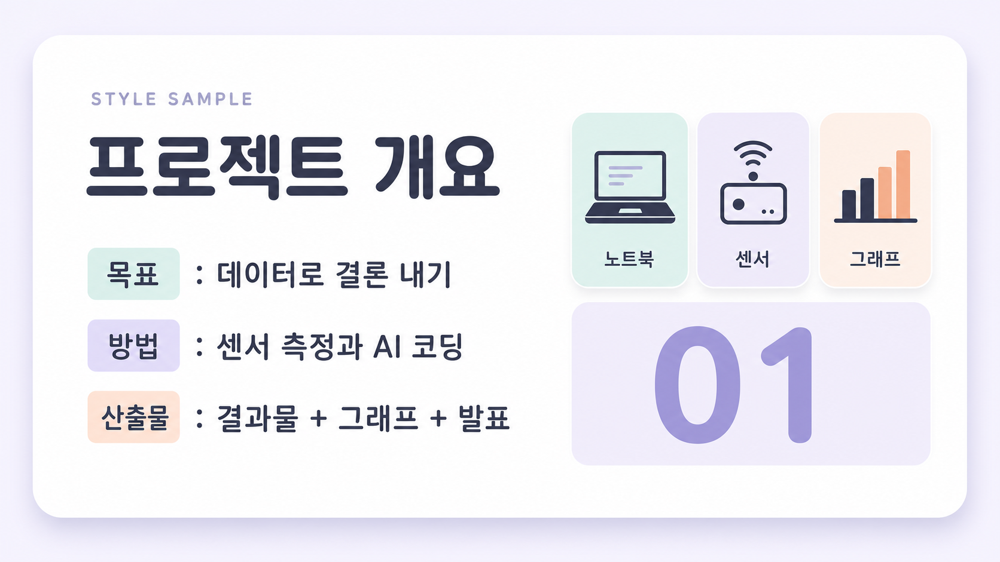

---

### 9. 볼드 인포그래픽 — `ppt-best-04`

흰 바탕 4색 컬러블록, 차트·스텝 인포그래픽.  
**최적 용도**: 프로세스·퍼널·수치 비교, 요약 인포그래픽

<details><summary><b>색감·타이포 상세</b> (펼치기)</summary>

| 항목 | 내용 |
|---|---|
| 색감 | 밝은 순백(#FFFFFF) 또는 아주 옅은 웜그레이(#F5F5F2) 바탕 위에 고채도 플랫 컬러 블록을 얹는다. 4대 기둥색은 일렉트릭 코발트블루(#1E5BFF)·비비드 코랄레드(#FF4A2E)·선명한 골든옐로(#FFC01E)·프레시 그린(#12B886), 강조에 마젠타퍼플(#7B2FF7)을 소량. 텍스트·아이콘 외곽선과 본문은 잉크블랙(#0E1116). 그래디언트 없이 하드엣지 솔리드 색면, 두꺼운 스트로크, 꽉 찬 볼드 아이콘, 굵은 화살표·스텝/플로우 커넥터, 통짜 막대·도넛 차트. 채도는 높게, 도형은 각지게, 배경-도형 대비를 극대화한다. |
| 한글 폰트 | 엑스트라볼드~블랙 굵기의 넓은 지오메트릭 고딕. 세리프 없음, 획 대비 없이 균일하게 두꺼운 스트로크, 속공간이 크고 자폭이 넓은 모던 고딕 인상. 대제목은 자간을 살짝 좁혀 통짜 덩어리감을 주고, 본문·부제는 미디엄~세미볼드로 굵기만 낮춰 위계 확보. 명조 인상은 배제하고 무게와 넓은 폭으로 강함을 낸다. (참고 힌트: Gmarket Sans Bold / Pretendard Black 계열 느낌.) |
| 영문 폰트 | 두 갈래로 운용. 라벨·스텝 태그는 헤비 그로테스크 산세리프를 전부 대문자·넓은 자간으로(STEP 01, DATA, KPI 같은 캡스 라벨). 데이터 수치는 폭 좁고 키 큰 초대형 콘덴스드 블랙 디스플레이로 화면을 압도. 공통으로 세리프 없음, 획 대비 없음, 숫자는 폭 일정한 탭ular 인상. (참고 힌트: Archivo Black / Druk Wide·Condensed 계열 느낌.) |
| 한글·영문 배열 | 한글 블랙 고딕 대제목이 상단·중앙의 무게 중심을 잡고, 그 위나 옆에 영문 소형 올캡스 그로테스크 라벨을 자간 넓혀 키커로 배치한다. 인포그래픽 핵심 수치는 영문·아라비아 숫자를 초대형 콘덴스드로 뽑아 시선 1순위로 삼는다. 위계는 초대형 숫자 > 한글 블랙 제목 > 한글 미디엄 본문 > 영문 소형 캡스 라벨 순. 역할 분담은 한글=의미 전달, 영문=리듬·데이터·섹션 라벨. |

</details>

**비주얼 애셋 규격**

| 요소 | 규격 |
|---|---|
| 사진 | 사진을 지양한다. 컬러 블록과 큰 아이콘이 사진 자리를 대신한다. |
| 아이콘·일러스트 | 굵은 아웃라인과 필을 섞은 아이콘을 카드 절반 크기로 아주 크게. **검정 외곽선은 아이콘에만 허용**하고 카드·컨테이너 프레임에는 쓰지 않는다. |
| 도표·차트 | 차트가 슬라이드의 주인공. 굵은 막대·스텝·퍼널·도넛을 색 블록으로 구분하고 값 라벨을 크게. |
| 3D | 지양한다. 플랫을 유지해야 정보가 빨리 읽힌다. |
| 배치 | 화면을 컬러 블록으로 분할하고 각 블록에 아이콘 + 숫자 + 한 줄을 넣는다. |
| 모드 B 텍스트 안전 영역 | 각 컬러 블록 내부 |

**조판 리듬**

| 항목 | 값 |
|---|---|
| 슬라이드당 메시지 | 1~2개 |
| 텍스트 상한 | 150자 (라벨 수준) |
| 표 상한 | 표보다 차트 우선 |
| 권장 레이아웃 | 컬러 블록 분할 + 대형 아이콘·차트 |

**주입 블록** — 아래 전문을 프롬프트 맨 앞에 그대로 붙인다 (`[1]+[2]` 합본)

```text
스타일: 밝은 순백 바탕(#FFFFFF, 옵션으로 옅은 웜그레이 #F5F5F2) 위에 고채도 플랫 컬러 블록을 배치한 볼드 인포그래픽. 코발트블루(#1E5BFF)·코랄레드(#FF4A2E)·골든옐로(#FFC01E)·프레시그린(#12B886)을 4대 기둥색으로, 마젠타퍼플(#7B2FF7)을 소량 강조로 쓰고, 텍스트와 아이콘 외곽선은 잉크블랙(#0E1116). 그래디언트 없이 하드엣지 솔리드 색면, 두꺼운 스트로크, 꽉 찬 볼드 아이콘, 굵은 화살표와 스텝·플로우 커넥터, 통짜 막대·도넛 차트로 스텝/플로우/데이터를 강조한다. 타이포는 한글=엑스트라볼드~블랙의 넓은 지오메트릭 고딕(세리프 없음, 획 대비 없이 균일하게 두껍고, 제목은 자간을 살짝 좁혀 덩어리감)으로 대제목을 세우고, 영문=헤비 그로테스크 산세리프를 전부 대문자·넓은 자간으로 스텝/섹션 라벨(STEP 01, DATA)에, 핵심 수치는 초대형 콘덴스드 블랙 디스플레이 숫자로 화면을 압도한다. 시각 위계는 초대형 숫자 > 한글 블랙 제목 > 한글 미디엄 본문 > 영문 소형 올캡스 라벨 순. 전체 인상은 채도 높은 색 대비와 굵은 획으로 밀어붙이는 강한 에너지의 정보 강조형 인포그래픽. 검정 테두리·오프셋 섀도·깨진 그리드는 쓰지 않아 브루탈리즘과 구분된다.

차트와 아이콘이 슬라이드의 주역이다. 사진은 쓰지 않고 선명한 컬러 블록으로 화면을 분할한 뒤 각 블록에 큰 아이콘과 숫자, 한 줄 라벨을 넣는다. 아이콘은 굵은 아웃라인과 필을 섞어 카드 절반에 이를 만큼 크게 만든다. 차트는 굵은 막대·스텝·퍼널·도넛으로 색 블록과 같은 팔레트를 쓰고 값 라벨을 크게 표기한다. 3D·그림자·광택은 쓰지 않고 완전한 플랫을 유지한다. 정보가 한눈에 읽히도록 텍스트는 라벨 수준으로 줄인다.
```

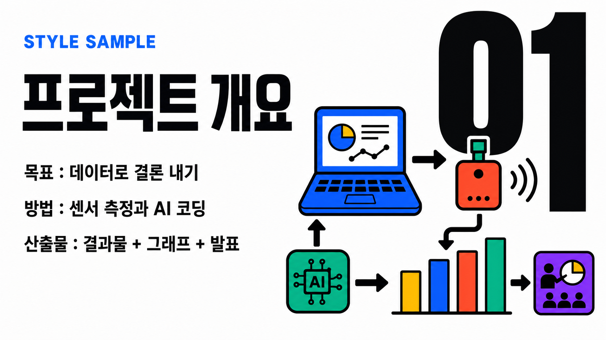

---

### 10. 프렌들리 라운드 — `ppt-best-05`

크레용·마커 손그림, 둥근 블롭, 워크숍 친화.  
**최적 용도**: 초중등 수업, 워크숍, 사내 교육

<details><summary><b>색감·타이포 상세</b> (펼치기)</summary>

| 항목 | 내용 |
|---|---|
| 색감 | 밝고 따뜻한 크림 아이보리 배경(#FFF6EA)에 코랄 오렌지(#FF8A5B), 선명한 머스터드 옐로(#FFC24B), 프레시 민트(#4FC3A1), 소프트 스카이 블루(#6FB7E8)로 짠 중간 채도 4색 팔레트. 텍스트와 외곽선은 짙은 웜 브라운(#4A3A30)으로 부드럽게 정돈. 그래픽은 두꺼운 둥근 라인, 크고 넉넉한 라운드 코너, 말랑한 블롭(물방울) 도형, 크레용·마커 질감의 손그림 일러스트와 도트·물결·별 같은 손그림 장식으로 채운다. 컬러는 원색보다 반 톤 밝게 눌러 눈이 편한 워크숍 무드. |
| 한글 폰트 | 둥근 고딕(라운드 산세리프). 중간~볼드 굵기, 넉넉하고 살짝 넓은 폭, 크고 열린 속공간, 획 끝이 동그랗게 마감된 부드러운 종결. 자간은 아주 살짝 여유 있게. 세리프·대비 없음. 제목은 볼드, 부제·본문은 미디엄으로 굵기만으로 위계를 만든다. |
| 영문 폰트 | 지오메트릭 라운드 산세리프. 볼드 굵기, 원형에 가까운 o/e와 동그란 획 끝, 넉넉한 폭. 섹션 라벨·키워드·번호는 소형 대문자(캡스)로 또렷하게, 헤드라인 보조 문구는 타이틀케이스. 장난기 있고 친근한 인상, 세리프 없음. |
| 한글·영문 배열 | 한글이 주역이다. 볼드 라운드 고딕 대형 제목이 화면 상단을 크게 차지하고, 그 위나 아래에 영문 라운드 캡스 소형 라벨(섹션명·키워드)과 둥근 숫자 뱃지를 악센트로 얹는다. 한글 제목 대 영문 라벨 크기비는 대략 4:1. 영문 캡스는 코랄/민트 알약형(pill) 배경 위 흰색으로, 한글 제목은 웜 브라운으로 색·형태 대비를 준다. |

</details>

**비주얼 애셋 규격**

| 요소 | 규격 |
|---|---|
| 사진 | 손그림 일러스트를 우선한다. 사진은 쓰지 않는다. |
| 아이콘·일러스트 | 크레용·마커 질감의 손그림 아이콘, 컬러 블롭 배경 위에. |
| 도표·차트 | 살짝 삐뚤한 손그림 막대, 둥근 캡, 밝은 색. 자로 잰 듯한 정밀함을 피한다. |
| 3D | 지양한다. |
| 배치 | 블롭·물결 배경 위에 캐릭터나 장면 일러스트를 놓고, 텍스트는 알약 모양 뱃지에. |
| 모드 B 텍스트 안전 영역 | 알약 뱃지 위치 (블롭 위) |

**조판 리듬**

| 항목 | 값 |
|---|---|
| 슬라이드당 메시지 | 1개 |
| 텍스트 상한 | 120자 (구어체 허용) |
| 표 상한 | 5행 |
| 권장 레이아웃 | 블롭 배경 + 캐릭터 일러스트 + 알약 뱃지 라벨 |

**주입 블록** — 아래 전문을 프롬프트 맨 앞에 그대로 붙인다 (`[1]+[2]` 합본)

```text
스타일: 밝고 따뜻한 크림 아이보리(#FFF6EA) 배경에 코랄 오렌지·머스터드 옐로·프레시 민트·소프트 스카이 블루의 중간 채도 4색 팔레트, 텍스트와 외곽선은 짙은 웜 브라운(#4A3A30). 크고 둥근 라운드 코너, 두꺼운 둥근 라인, 말랑한 블롭 도형, 크레용·마커 질감의 손그림 일러스트와 도트·물결·별 장식으로 화면을 채운다. 타이포는 세리프 없는 둥근 고딕이 주역 — 한글 대형 제목은 볼드에 넉넉한 폭, 크고 열린 속공간, 동그랗게 마감된 획 끝, 살짝 여유 있는 자간으로 배치하고, 부제·본문은 미디엄으로 굵기 위계를 준다. 영문과 숫자는 지오메트릭 라운드 산세리프 볼드로 처리하고, 섹션 라벨·키워드는 소형 대문자(캡스)를 코랄/민트 알약형 배경 위 흰색으로 얹어 악센트를 준다. 한글 제목 대 영문 라벨 크기비는 약 4:1, 한글은 웜 브라운, 영문 캡스는 컬러 뱃지 위 흰색으로 대비. 전체적으로 초중등·워크숍에 어울리는 친근하고 말랑한 인상. 크레용·블롭·알약 뱃지의 손그림 질감이 깔끔한 카드 UI의 소프트 파스텔·3D 아이소메트릭과 갈린다.

손그림 일러스트가 비주얼의 중심이다. 사진은 쓰지 않고, 크레용이나 마커 질감의 손그림 아이콘과 캐릭터·장면 일러스트를 컬러 블롭 배경 위에 배치한다. 차트도 자로 잰 듯한 정밀함을 피하고 살짝 삐뚤한 손그림 막대에 둥근 캡, 밝은 색을 쓴다. 3D·광택은 쓰지 않는다. 텍스트는 알약 모양 뱃지 안에 짧게 넣고 구어체를 허용해 친근한 인상을 만든다.
```

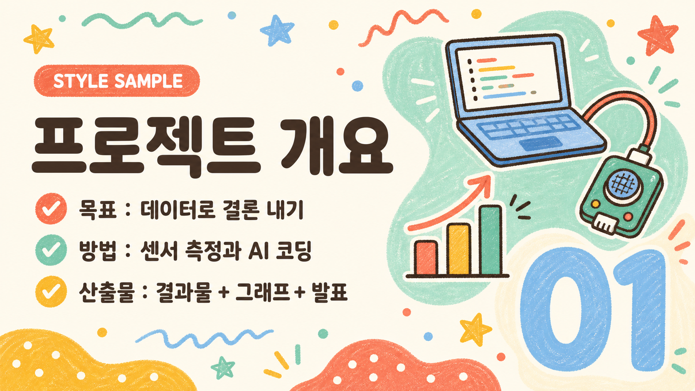

---

## 최신트렌드

### 11. 글래스모피즘 — `ppt-trend-01`

그라데이션 위 반투명 유리 카드, 블러 UI.  
**최적 용도**: SaaS·앱 제품 소개, 기능 하이라이트

<details><summary><b>색감·타이포 상세</b> (펼치기)</summary>

| 항목 | 내용 |
|---|---|
| 색감 | 쿨 계열 2톤 라이트 글래스모피즘. 배경은 라벤더 바이올렛(#8B7CF6)에서 소프트 시안(#6FD6E8)으로 흐르는 절제된 2색 메시 그라데이션(하단에 아주 옅은 로즈핑크 #F5B8D0가 살짝만 번짐). 그 위에 큼직한 프로스티드 유리 카드 하나(흰색 12~20% 불투명도)를 정돈되게 얹고 배경을 강하게 블러. 카드 테두리는 흰색 40~60% 얇은 하이라이트로 빛을 머금고, 부드러운 확산 그림자로 떠 있는 UI 깊이감. 텍스트는 딥 인디고/슬레이트(#1E1B3A~#2D2A4A), 포인트는 단색 일렉트릭 바이올렛(#7C5CFF) 하나로만 또렷하게(그라데이션 텍스트·다색 난반사 배제). 차분하고 구조적인 밝은 프로덕트 UI 톤. |
| 한글 폰트 | 산세리프(세리프 없음), 미디엄~세미볼드, 표준~살짝 넓은 폭, 열린 속공간, 균일하고 낮은 획 대비, 넉넉한 자간. 제목은 세미볼드로 또렷·구조적으로, 부제·본문은 레귤러~미디엄으로 안정적으로 읽히게. 유리의 투명·경량 인상과 어울리되 정돈된 UI 카드 안에서 무게중심을 확실히 잡는 현대적 인상. |
| 영문 폰트 | 지오메트릭 산세리프(세리프 없음), 원형에 가까운 O/C/G 글자꼴, 낮은 획 대비. 디스플레이 헤드라인은 씬~라이트 굵기에 전부 대문자(ALL CAPS)·아주 넓은 트래킹으로 건축적이고 정돈된 UI 간판 인상. 소형 라벨·섹션 번호도 미디엄 대문자에 넓은 트래킹. 이탤릭·장식·소문자 헤드라인 없음 — 대문자 정렬이 이 스타일의 케이스 서명. |
| 한글·영문 배열 | 하나의 유리 카드 안에서 위→아래로 구조적으로 정렬. (1) 상단 영문 소형 대문자 캡스 라벨(넓은 트래킹) 섹션 태그. (2) 그 아래 영문 씬~라이트 대문자 디스플레이 헤드라인(넓은 자간)이 시각 정점. (3) 한글 미디엄~세미볼드 부제를 헤드라인의 40~50% 크기로 두어 가독 무게중심. 전부 대문자 영문의 정렬감과 넉넉한 여백, 좌측 또는 카드 중앙 정렬. 포인트는 단색 바이올렛 하나로 절제. |

</details>

**비주얼 애셋 규격**

| 요소 | 규격 |
|---|---|
| 사진 | 사진은 유리 카드 뒤에 블러 처리해 배경으로만. 카드 위에 선명한 사진을 올리지 않는다. |
| 아이콘·일러스트 | 얇은 라인 아이콘(흰색 또는 바이올렛)을 유리 카드 안에. |
| 도표·차트 | 반투명 카드 위에 얇은 라인 차트, 데이터 포인트에 은은한 글로우. |
| 3D | 부드러운 3D 오브(구·유리 형태)를 배경 장식으로 허용한다. |
| 배치 | 쿨 2색 메시 그라데이션 배경 위에 중앙 정렬 유리 카드 **1장이 기본**. 좌우 비교형에서만 2장으로 늘린다. |
| 모드 B 텍스트 안전 영역 | 유리 카드 내부 |

**조판 리듬**

| 항목 | 값 |
|---|---|
| 슬라이드당 메시지 | 1개 |
| 텍스트 상한 | 140자 |
| 표 상한 | 5행 (카드 안 목록 선호) |
| 권장 레이아웃 | 그라데이션 배경 + 반투명 유리 카드 중앙 배치 |

**주입 블록** — 아래 전문을 프롬프트 맨 앞에 그대로 붙인다 (`[1]+[2]` 합본)

```text
스타일: 라벤더 바이올렛(#8B7CF6)에서 소프트 시안(#6FD6E8)으로 흐르는 절제된 쿨 2색 메시 그라데이션 배경(하단에 로즈핑크가 아주 옅게만 번짐) 위에 큼직한 프로스티드 유리 카드 하나를 정돈되게 얹은 라이트 글래스모피즘. 카드는 흰색 12~20% 불투명도에 강한 배경 블러, 테두리는 흰색 40~60% 얇은 하이라이트로 빛을 머금고, 부드러운 확산 그림자로 떠 있는 구조적 UI 깊이감. 타이포는 세리프 없는 지오메트릭 산세리프로 통일하되 영문은 전부 대문자(ALL CAPS)로 간다 — 영문 디스플레이 헤드라인은 씬~라이트 굵기에 아주 넓은 트래킹의 대문자로 건축적이고 정돈된 UI 간판처럼 크게, 그 아래 한글 부제는 미디엄~세미볼드 산세리프에 살짝 넓은 폭과 넉넉한 자간으로 가독 무게중심을 확실히 잡는다. 섹션 번호·메타 라벨은 소형 대문자에 넓은 트래킹으로 정돈. 텍스트 색은 딥 인디고/슬레이트(#1E1B3A~#2D2A4A), 포인트는 단색 일렉트릭 바이올렛(#7C5CFF) 하나로만 또렷하게 쓰고 그라데이션 텍스트는 쓰지 않는다. 하나의 유리 카드 안에 요소를 좌측 또는 중앙으로 구조적으로 정렬한, 밝고 투명하며 차분한 프로덕트 UI 인상.

배경은 쿨한 2색 메시 그라데이션으로 깔고 그 위에 반투명 유리 카드를 중앙에 한 장 올린다(좌우 비교형에서만 두 장). 사진은 유리 카드 뒤에 블러 처리해 배경으로만 쓰고 카드 위에 선명한 사진을 올리지 않는다. 아이콘은 흰색이나 바이올렛의 얇은 라인으로 유리 카드 안에 넣는다. 차트는 반투명 카드 위 얇은 라인 형태로 그리고 데이터 포인트에만 은은한 글로우를 준다. 3D는 부드러운 유리질 구체를 배경 장식으로만 허용한다. 테두리에 미세한 하이라이트를 넣어 유리 질감을 살린다.
```

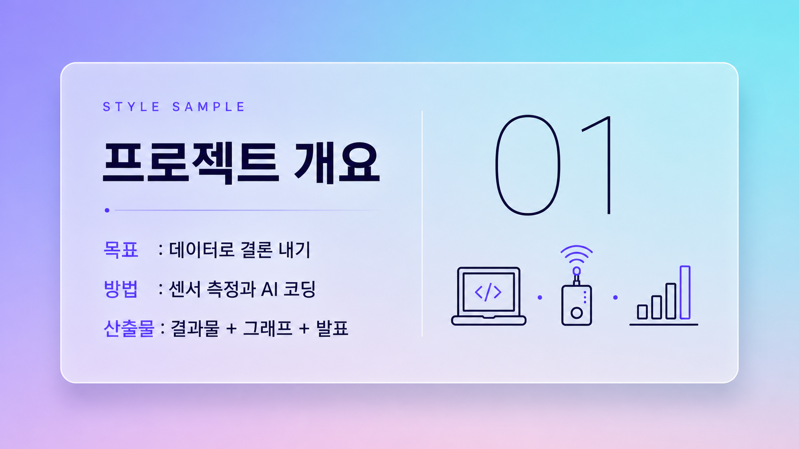

---

### 12. 브루탈리즘 볼드 — `ppt-trend-02`

굵은 검정 테두리·원색 블록·초대형 타이포, 뉴브루탈리즘.  
**최적 용도**: 크리에이티브 제안, 강한 선언, 전시·굿즈

<details><summary><b>색감·타이포 상세</b> (펼치기)</summary>

| 항목 | 내용 |
|---|---|
| 색감 | 종이 질감의 미색 오프화이트 배경(#F7F3E8, 또는 스타크 화이트 #FFFFFF)에 순수 검정(#111111) 굵은 테두리를 4~8px로 모든 블록·글상자·이미지에 두른다. 원색 블록은 일렉트릭 옐로(#FFE500), 코발트/일렉트릭 블루(#2340FF), 토마토 레드(#FF3B2F), 핫핑크(#FF5CA0) 중 3~4색만 크게 채워 쓴다. 그라데이션·소프트 섀도·중간톤 완전 금지. 대신 각지고 딱 떨어지는 검정 하드 오프셋 섀도(6~10px, 흐림 0)로만 입체감을 준다. 채도는 최대, 면적 대비는 극단(거대한 원색 면 vs 좁은 검정 여백). |
| 한글 폰트 | 세리프 없는 초굵은 블랙/헤비 웨이트 고딕. 자폭은 정체~약간 넓게, 속공간이 꽉 차 거의 사각형에 가까운 덩어리 인상, 자간은 타이트하게 조여 단단함. 제목은 최대 굵기로 짓눌린 듯 묵직하게, 부제·본문은 미디엄~볼드로 한 단계만 낮춰 색이 아닌 굵기로 위계를 만든다. 곡선·장식 최소화, 획 두께 균일해 거칠고 산업적인 인상. |
| 영문 폰트 | 영문·숫자는 초대형 디스플레이 그로테스크(네오그로테스크/고딕 계열) 블랙 웨이트, 전부 대문자, 자간을 극단적으로 타이트하게(글자끼리 닿을 듯) 조인다. 획 두께 균일하고 대비는 낮으며, 정체 또는 약간 콘덴스드해 세로로 길고 육중하게. 작은 라벨·캡션·페이지번호는 모노스페이스 느낌의 소형 대문자로, 반대로 자간을 넓게 벌려 태그처럼 처리. |
| 한글·영문 배열 | 영문 대문자 초대형 헤드라인이 화면을 압도하는 주역(가장 큼, 원색 블록이나 검정 박스에 걸침), 그 아래·옆에 한글 굵은 제목을 중간 크기로 비대칭 배치해 스케일 대비를 만든다. 한글은 검정 박스 안 흰 글자 반전 또는 원색 블록 위에 얹어 강조하고, 영문 소형 대문자 라벨은 넓은 자간으로 모서리에 태그처럼 흩뿌린다. 요소들은 그리드를 의도적으로 어긋내 겹치고 색 블록 경계 밖으로 삐져나오게 한다. |

</details>

**비주얼 애셋 규격**

| 요소 | 규격 |
|---|---|
| 사진 | 거친 컷아웃 사진 콜라주를 쓴다. 흑백이나 원색으로 처리하고 하드 오프셋 섀도와 함께 삐뚤게 배치. |
| 아이콘·일러스트 | 두꺼운 검정 아웃라인 아이콘에 원색 필. |
| 도표·차트 | 굵은 검정 테두리 막대와 원색 블록. 축은 손으로 그은 듯 거칠게. |
| 3D | 지양한다. 입체감은 하드 오프셋 섀도로만 만든다. |
| 배치 | 깨진 그리드. 요소가 겹치고 회전해도 좋다. 크롭마크·모노스페이스 태그를 여백에. |
| 모드 B 텍스트 안전 영역 | 가장 큰 여백 블록 (깨진 그리드 중) |

**조판 리듬**

| 항목 | 값 |
|---|---|
| 슬라이드당 메시지 | 1개 |
| 텍스트 상한 | 60자 (초대형 1~2단어 + 짧은 문장) |
| 표 상한 | 표 지양 |
| 권장 레이아웃 | 초대형 타이포 + 컷아웃 콜라주 + 하드 섀도 블록 |

**주입 블록** — 아래 전문을 프롬프트 맨 앞에 그대로 붙인다 (`[1]+[2]` 합본)

```text
스타일: 뉴브루탈리즘 볼드. 종이 질감의 미색 오프화이트 배경에 순수 검정 굵은 테두리(4~8px)를 모든 블록·글상자·이미지에 두르고, 일렉트릭 옐로·코발트 블루·토마토 레드·핫핑크 중 3~4색만 큰 면적의 원색 블록으로 채운다. 그라데이션·소프트 섀도 없이 각지고 딱 떨어지는 검정 하드 오프셋 섀도(흐림 0)로만 입체를 준다. 영문·숫자는 초대형 그로테스크 블랙 웨이트 전부 대문자에 자간을 극단적으로 조여 화면을 압도하는 주역으로 세우고, 한글은 세리프 없는 초굵은 블랙 고딕을 중간 크기 제목/부제로 비대칭 배치하되 검정 박스 안 흰 글자 반전이나 원색 블록 위에 얹어 대비시킨다. 작은 영문 라벨은 모노스페이스 느낌 소형 대문자에 자간을 넓게 벌려 모서리에 태그처럼 흩뿌린다. 그리드를 의도적으로 어긋내 요소가 겹치고 색 블록 밖으로 삐져나오는, 거칠고 단단한 극단적 비대칭 구성.

거친 컷아웃 사진 콜라주가 비주얼의 핵심이다. 사진은 흑백이나 원색으로 처리해 가장자리를 거칠게 오려내고 하드 오프셋 섀도와 함께 살짝 기울여 배치한다. 아이콘은 두꺼운 검정 아웃라인에 원색을 채운다. 차트는 굵은 검정 테두리 막대와 원색 블록으로 만들고 축은 손으로 그은 듯 거칠게 남긴다. 3D·그라데이션·부드러운 그림자는 쓰지 않고 입체감은 하드 오프셋 섀도로만 만든다. 그리드를 의도적으로 깨뜨리고 크롭마크와 모노스페이스 태그를 여백에 흩어 놓는다.
```

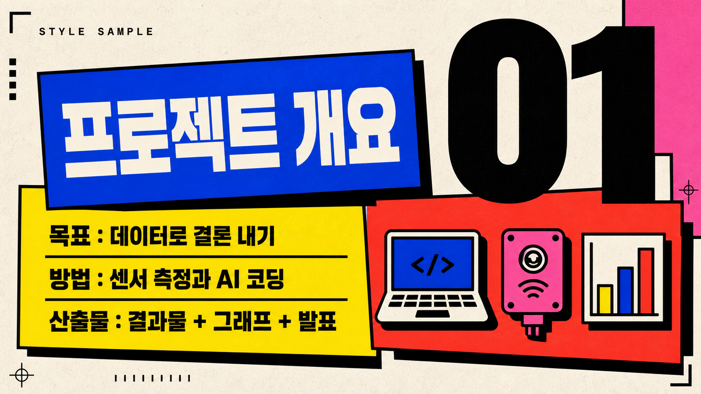

---

### 13. 그라디언트 메시 — `ppt-trend-03`

메시 그라데이션 배경, 광택 리퀴드 라이트 UI.  
**최적 용도**: 비전·컨셉·브랜드 방향 제시

<details><summary><b>색감·타이포 상세</b> (펼치기)</summary>

| 항목 | 내용 |
|---|---|
| 색감 | 라벤더(#C9C6FF)·피치(#FFD9C7)·스카이블루(#C7E4FF)·민트(#CFF5E7)·연분홍(#FFD4E8)이 경계 없이 번져 섞이는 다색·고명도 리퀴드 메시 그라데이션 배경 — 따뜻한 피치·연분홍까지 폭넓게 순환해 웜톤이 함께 흐른다. 그 위에 반투명 젖빛 유리 패널(글래스모피즘)을 얹어 흐릿한 블러, 은은한 광택 하이라이트, 얇은 흰색 테두리로 리퀴드한 입체감을 낸다. 본문 텍스트는 짙은 잉크 네이비/차콜(#1C1B2E)로 밝은 배경과 또렷이 대비하고, 포인트는 바이올렛→핑크로 이어지는 채도 높은 그라데이션 스트로크 한 줄만 절제해 쓴다(단색 포인트가 아니라 그라데이션 획이 시그니처). 전체 톤은 맑고 촉촉하며 공기감 있는 다색 리퀴드 UI. |
| 한글 폰트 | 현대적인 기하학 산세리프(돋움 계열). 획 대비 없이 균일하고 모서리가 살짝 부드러운 인상, 표준 폭. 부제·본문은 중간 굵기(medium)로 또렷하게, 자간은 살짝 넉넉히 벌려 파스텔 배경의 공기감과 호흡을 맞춘다. 명조·세리프 인상은 쓰지 않고 위계는 오직 굵기와 크기로만 만든다 — 큰 제목이 필요해도 세미볼드까지만 올리고 헤어라인처럼 얇게 가지 않는다. |
| 영문 폰트 | 세리프 없는 기하학 지오메트릭 산세리프. 획 대비가 낮고 원형 볼(o, e, c)이 또렷한 매끈한 형태. 대형 디스플레이 헤드라인은 라이트~레귤러 굵기에 소문자 또는 타이틀 케이스·넓은 자간으로 공기감 있게(대문자 헤드라인 아님 — 캡스 헤드라인의 글래스모피즘과 케이스로 대비된다). 상단 키커/라벨만 소형 대문자(all-caps)에 아주 넓은 자간으로. 광택 있는 라이트 유리 UI에 어울리는 깔끔하고 미끈한 인상. |
| 한글·영문 배열 | 위→아래 3단 위계에 약간의 비대칭 리퀴드 배치. (1) 키커: 소형 영문 올캡스, 아주 넓은 자간, 라이트 굵기 — 섹션 태그. (2) 히어로: 대형 영문 지오메트릭 산세리프 디스플레이(라이트~레귤러, 넓은 자간, 소문자/타이틀 케이스)가 시각 중심. (3) 부제: 한글 중간 굵기 산세리프를 히어로의 40~50% 크기로 그 아래 배치, 자간 약간 넉넉. 대비 원리 — 영문은 크고·얇고·넓게(공기감), 한글은 중간 굵기로 또렷이 읽히게. 포인트 그라데이션 획 한 줄로 리듬을 준다. |

</details>

**비주얼 애셋 규격**

| 요소 | 규격 |
|---|---|
| 사진 | 사진을 지양한다. 색 번짐 배경과 리퀴드 블롭이 그 자리를 대신한다. |
| 아이콘·일러스트 | 얇은 라인 아이콘. 그라데이션 스트로크는 **장식용 한 줄에만** 쓰고, 아이콘과 데이터 시각화는 예외로 그라데이션을 허용한다. |
| 도표·차트 | 그라데이션으로 채운 에어리어 차트, 부드러운 곡선. 각진 형태를 피한다. |
| 3D | 리퀴드 3D 블롭과 글래스 오브를 허용한다. |
| 배치 | 비대칭 편집형. 블롭이 텍스트 뒤로 흐르며 레이어를 만든다. |
| 모드 B 텍스트 안전 영역 | 블롭이 흐르지 않는 쪽 (좌 또는 우) |

**조판 리듬**

| 항목 | 값 |
|---|---|
| 슬라이드당 메시지 | 1개 |
| 텍스트 상한 | 120자 |
| 표 상한 | 4행 (표 지양) |
| 권장 레이아웃 | 메시 그라데이션 배경 + 리퀴드 블롭 + 비대칭 텍스트 |

**주입 블록** — 아래 전문을 프롬프트 맨 앞에 그대로 붙인다 (`[1]+[2]` 합본)

```text
스타일: 라벤더·피치·스카이블루·민트·연분홍이 경계 없이 흐르는 다색·고명도 리퀴드 메시 그라데이션 배경(웜톤 피치·연분홍까지 폭넓게 순환), 그 위에 흐릿한 블러와 은은한 광택·얇은 흰 테두리를 가진 반투명 젖빛 유리 패널(글래스모피즘)을 얹어 리퀴드한 공기감을 낸다. 타이포는 세리프 없는 미끈한 기하학 산세리프 계열로 통일하되 영문 헤드라인은 소문자 또는 타이틀 케이스로 간다 — 상단에 소형 영문 올캡스 키커를 아주 넓은 자간으로 얇게 놓고, 그 아래 대형 영문 지오메트릭 산세리프 헤드라인을 라이트~레귤러 굵기·넓은 자간·소문자/타이틀 케이스로 크게 배치해 시각 중심을 잡는다(대문자 헤드라인은 쓰지 않아 케이스로 글래스모피즘과 구분). 다시 그 아래 한글 부제는 중간 굵기 산세리프로 헤드라인의 40~50% 크기, 자간을 살짝 넉넉히 벌려 또렷하게 읽히게 한다(한글은 명조 인상 없이 굵기·크기로만 위계). 본문 텍스트는 짙은 잉크 네이비/차콜(#1C1B2E)로 밝은 배경과 또렷이 대비하고, 포인트는 바이올렛→핑크로 이어지는 채도 높은 그라데이션 스트로크 한 줄만 절제해 시그니처로 쓴다. 좌측 기준의 약간 비대칭 리퀴드 배치, 유리 패널 안 넉넉한 여백, 맑고 촉촉한 다색 밝은 UI.

부드러운 색 번짐 배경과 리퀴드 형태가 비주얼을 이끈다. 사진은 쓰지 않고 메시 그라데이션 배경 위에 유동적인 블롭이 텍스트 뒤로 흐르며 레이어를 만들게 한다. 장식용 그라데이션 스트로크는 화면에 한 줄만 쓴다. 아이콘과 차트는 이 제한의 예외로, 얇은 라인에 그라데이션을 허용한다. 차트는 그라데이션으로 채운 에어리어 형태와 부드러운 곡선으로 그리고 각진 형태는 피한다. 3D는 리퀴드 블롭과 글래스 오브까지 허용한다. 레이아웃은 비대칭 편집형으로 여백을 크게 남긴다.
```

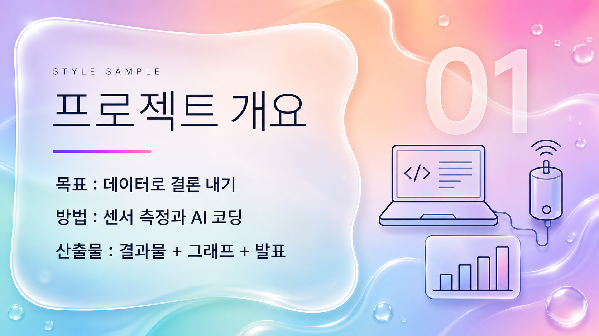

---

### 14. 다크 네온 — `ppt-trend-04`

짙은 배경+네온 시안·마젠타 발광, 테크 무대.  
**최적 용도**: 테크 컨퍼런스, 게임·엔터, 데모 무대

<details><summary><b>색감·타이포 상세</b> (펼치기)</summary>

| 항목 | 내용 |
|---|---|
| 색감 | 짙은 남색-차콜 그라디언트 배경(#0A0E1A→#141A30)에 무대 뒤 은은한 방사형 발광. 포인트는 네온 시안(#22EEFF)과 네온 마젠타(#FF3CD6) 딱 두 색 대비, 얇은 발광 라인과 외곽 글로우(bloom)로만 강조한다. 본문·제목 텍스트는 고휘도 오프화이트(#EAF4FF)로 대비를 확보해 한글 가독성을 지키고, 강조어와 숫자만 네온 색을 쓴다. 채도 높은 네온은 면적을 작게, 배경은 무광 딥톤으로 눌러 명암 대비를 키운다. |
| 한글 폰트 | 세리프 없는 기하학적 산세리프. 중간~볼드(Medium~Bold)의 균일하고 굵은 획으로 통일하고 얇은 웨이트는 금지한다(발광 배경에서 가는 획이 번져 뭉개지는 것 방지). 폭은 표준~살짝 넓게, 자간은 0에서 약간 좁게(타이트하되 붕괴 없이). 열린 속공간과 낮은 획 대비로 어두운 배경 위 판독성을 확보한다. 제목은 볼드, 부제·본문은 미디엄. 참고 인상은 프리텐다드/노토산스 계열의 깔끔한 현대 고딕이되 폰트명이 아니라 '굵고 균일한 산세리프'라는 시각 속성으로 구현한다. |
| 영문 폰트 | 두 역할로 분리. (1) 디스플레이 헤드라인: 넓은(wide) 기하학적 그로테스크, 전부 대문자, 트래킹을 넓게 벌리고 네온 시안 글로우를 입혀 테크 무대 간판 인상. (2) 라벨·캡션: 모노스페이스 테크노 인상, 소형 대문자(small caps), 넓은 자간, 얇지 않은 미디엄 굵기. 숫자는 등폭(모노스페이스) 숫자로 데이터 대시보드 느낌을 준다. 전 구간 세리프 없음. |
| 한글·영문 배열 | 영문 대형 디스플레이 헤드라인(대문자·넓은 자간·네온 시안 글로우)을 시각적 정점으로 올리고, 그 바로 아래 한글 볼드 제목을 오프화이트로 두어 실제 판독 정보를 담당시킨다(영문=분위기, 한글=내용). 상단과 모서리에는 모노스페이스 소형 캡스 영문 라벨(예: SECTION 01 / DATA)과 등폭 숫자를 시안·마젠타 포인트로 얹는다. 위계는 영문 초대형 헤드라인 > 한글 대형 볼드 제목 > 한글 미디엄 부제 > 영문 모노 캡스 소형 라벨 순. 한글은 항상 고휘도 무채색으로 유지해 네온이 번져도 읽히게 한다. |

</details>

**비주얼 애셋 규격**

| 요소 | 규격 |
|---|---|
| 사진 | 사진을 쓰면 크게 어둡게 깔고 시안·마젠타 네온 림라이트를 넣는다. 대체로 홀로그램 렌더를 선호. |
| 아이콘·일러스트 | 네온 글로우 라인 아이콘(시안·마젠타). |
| 도표·차트 | 어두운 배경에 발광하는 라인 차트. 격자는 아주 어둡게 깔고 값만 빛나게. |
| 3D | 와이어프레임·홀로그램 3D를 허용한다. 제품·데이터 시각화에 특히 잘 맞는다. |
| 배치 | HUD 프레임과 코너 브래킷, 모노스페이스 라벨로 감싼다. |
| 모드 B 텍스트 안전 영역 | HUD 프레임 내부 |

**조판 리듬**

| 항목 | 값 |
|---|---|
| 슬라이드당 메시지 | 1개 |
| 텍스트 상한 | 100자 (밝은 계열 대비 30퍼센트 감축) |
| 표 상한 | 4~5행, 셀 배경 대비를 높일 것 |
| 권장 레이아웃 | 다크 배경 + 네온 글로우 비주얼 + HUD 프레임 |

**주입 블록** — 아래 전문을 프롬프트 맨 앞에 그대로 붙인다 (`[1]+[2]` 합본)

```text
스타일: 짙은 남색-차콜 그라디언트 배경에 무대 뒤 방사형 발광이 은은히 깔린 다크 네온 테크 무대. 포인트 컬러는 네온 시안과 네온 마젠타 두 색뿐이며, 얇은 발광 라인과 외곽 글로우(bloom)로만 강조하고 채도 높은 네온은 작은 면적에만 쓴다. 타이포는 세리프 없는 기하학적 산세리프로 통일한다 — 영문은 전부 대문자의 넓은 그로테스크 디스플레이 헤드라인에 넓은 자간과 시안 글로우를 입혀 무대 간판처럼 시각적 정점을 만들고, 그 아래 한글은 중간~볼드의 굵고 균일한 획을 가진 현대 고딕으로 고휘도 오프화이트(#EAF4FF)에 얹어 내용을 또렷하게 읽힌다(얇은 웨이트 금지, 발광 번짐 방지). 모서리와 상단에는 모노스페이스 테크노 인상의 소형 대문자 영문 라벨과 등폭 숫자를 시안·마젠타 포인트로 배치해 데이터 대시보드 같은 테크 질감을 준다. 위계는 영문 초대형 헤드라인 > 한글 대형 볼드 제목 > 한글 미디엄 부제 > 영문 모노 캡스 소형 라벨 순으로 뚜렷하게 둔다.

어두운 배경 위에서 네온이 빛나는 화면을 만든다. 사진을 쓸 경우 크게 어둡게 깔고 시안·마젠타 네온 림라이트를 넣으며, 가능하면 사진 대신 와이어프레임이나 홀로그램 렌더를 쓴다. 아이콘은 네온 글로우 라인으로 그린다. 차트는 아주 어두운 격자 위에 발광하는 라인과 값만 빛나게 그린다. 3D는 와이어프레임·홀로그램 형태로 허용한다. 화면 가장자리를 HUD 프레임과 코너 브래킷, 모노스페이스 라벨로 감싼다. 어두운 배경에서는 한글 가독성이 떨어지므로 글자 수를 줄이고 대비를 충분히 확보한다.
```

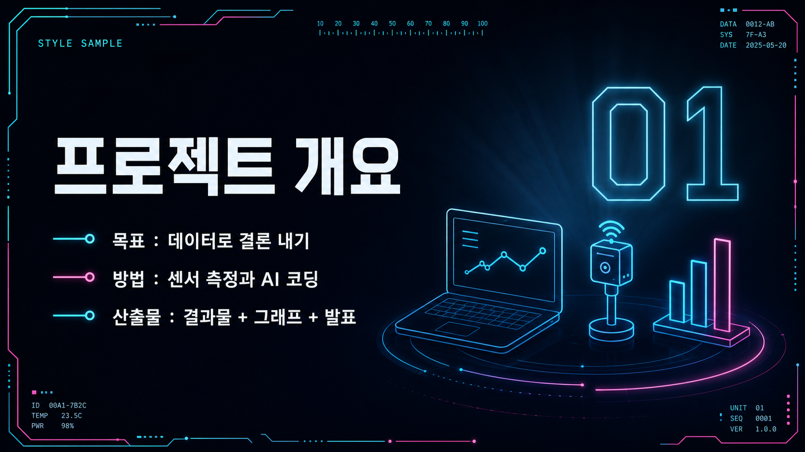

---

### 15. 3D 아이소메트릭 — `ppt-trend-05`

입체 아이소메트릭 아이콘/장면, 경쾌한 3D.  
**최적 용도**: 시스템·구조·워크플로우 소개, 제품 아키텍처

<details><summary><b>색감·타이포 상세</b> (펼치기)</summary>

| 항목 | 내용 |
|---|---|
| 색감 | 배경은 아주 옅은 쿨 화이트에 미세한 라벤더·블루 기운이 도는 청량하고 밝은 톤(#F3F6FC ~ #EEF2FB). 오브젝트는 30도 기울어진 입체 아이소메트릭 아이콘/장면으로, 둥근 모서리에 매끈한 플라스틱·클레이 질감. 경쾌한 중채도 컬러 블록: 코랄 #FF6B6B, 스카이블루 #4D9DE0, 민트 #3FD9B0, 선샤인옐로 #FFD166, 라벤더 #A78BFA. 그림자는 검정이 아니라 쿨 그레이블루의 낮은 불투명도 소프트 섀도(#C7D0E6, 12~20%)로 오브젝트 아래 부드럽게 번지듯 깔림. 텍스트는 잉크 네이비(#20264A)로 밝은 배경 위에서 또렷하게. 전체 여백은 넉넉하고 명랑한 SaaS·테크 일러스트 무드. |
| 한글 폰트 | 끝이 둥근 라운드 지오메트릭 고딕 인상. 세리프 없음. 미디엄~세미볼드 굵기, 약간 넓은 자족폭(살짝 와이드), 여유로운 자간으로 가볍고 친근하게. 획 대비는 거의 없이 균일하고, 속공간(내부 여백)이 큰 통통한 실루엣 — 입체 아이콘의 둥근 볼륨감과 톤을 맞춘다. 부제·본문 역할로 헤드라인보다 한 급 작게. |
| 영문 폰트 | 지오메트릭 산세리프, 스트로크 종단이 둥근 라운드 터미널. 큰 x-height, 거의 정원에 가까운 'o', 균일한 저대비. 헤드라인은 볼드~엑스트라볼드 대형 디스플레이(타이틀케이스), 자간은 약간 넉넉하게(타이트하지 않게). 섹션 라벨·태그는 작은 대문자(small caps) 볼드 + 넓은 자간, 액센트 컬러. 숫자·수치도 같은 라운드 지오메트릭 볼드로 크게. |
| 한글·영문 배열 | 영문 대형 라운드 디스플레이 헤드라인(엑스트라볼드, 타이틀케이스)을 최상단 시각 앵커로 크게 세우고, 바로 아래 한글 미디엄~세미볼드 라운드 산세리프 부제를 한 급 작게 병렬. 위계는 영문 헤드라인 > 한글 부제 > 소형 캡스 라벨 순. 섹션 태그/카테고리는 영문 small caps 볼드에 넓은 자간을 주고 코랄·스카이블루 등 액센트 컬러로 포인트. 큰 수치·KPI는 영문 라운드 볼드 대형으로, 단위 라벨은 한글 세미볼드 소형으로 붙임. 텍스트 블록은 좌측, 입체 아이소메트릭 오브젝트는 우측에 배치해 넉넉한 여백으로 균형. |

</details>

**비주얼 애셋 규격**

| 요소 | 규격 |
|---|---|
| 사진 | 사진 대신 3D 아이소메트릭 장면을 만든다. |
| 아이콘·일러스트 | 아이소메트릭 3D 아이콘. 클레이·플라스틱 질감에 부드러운 그림자. |
| 도표·차트 | 아이소 각도로 세운 막대·플랫폼 차트를 절제해서. 정확한 수치 비교가 필요하면 정면 차트를 쓴다. |
| 3D | 핵심 표현 수단. 30도 아이소 각도와 조명 방향을 전 슬라이드에서 통일한다. |
| 배치 | 중앙~우측에 아이소 장면 하나를 크게, 텍스트는 좌측에. |
| 모드 B 텍스트 안전 영역 | 좌측 40% |

**조판 리듬**

| 항목 | 값 |
|---|---|
| 슬라이드당 메시지 | 1개 |
| 텍스트 상한 | 140자 |
| 표 상한 | 5행 |
| 권장 레이아웃 | 좌측 텍스트 + 우측 대형 아이소메트릭 장면 |

**주입 블록** — 아래 전문을 프롬프트 맨 앞에 그대로 붙인다 (`[1]+[2]` 합본)

```text
스타일: 밝고 경쾌한 3D 아이소메트릭 프레젠테이션. 배경은 아주 옅은 쿨 화이트(#F3F6FC)에 라벤더·블루 기운이 미세하게 도는 청량한 밝은 톤. 화면 우측에 30도 기울어진 입체 아이소메트릭 아이콘/장면을 배치하되 둥근 모서리와 매끈한 플라스틱·클레이 질감으로 그리고, 코랄(#FF6B6B)·스카이블루(#4D9DE0)·민트(#3FD9B0)·선샤인옐로(#FFD166)·라벤더(#A78BFA)의 경쾌한 중채도 컬러 블록으로 채운다. 그림자는 검정이 아니라 쿨 그레이블루(#C7D0E6)의 낮은 불투명도 소프트 섀도로 오브젝트 아래 부드럽게 깔린다. 타이포그래피: 헤드라인은 영문 대형 지오메트릭 라운드 산세리프 — 끝이 둥근 스트로크, 큰 x-height, 거의 정원에 가까운 'o', 볼드~엑스트라볼드, 약간 넉넉한 자간, 타이틀케이스로 좌측 상단에 크게. 그 아래 한글 부제는 같은 라운드 계열의 미디엄~세미볼드, 약간 넓은 자족폭과 여유로운 자간으로 가볍고 친근하게(세리프 없음). 섹션 라벨·태그는 영문 작은 대문자(small caps) 볼드에 넓은 자간을 주고 액센트 컬러로 포인트하며, 수치·숫자는 영문과 같은 라운드 지오메트릭 볼드로 크게 표기한다. 텍스트는 잉크 네이비(#20264A)로 또렷하게. 전체적으로 여백이 넉넉하고 부드러운 3D 그림자와 명랑한 컬러가 밝은 SaaS·테크 일러스트 무드를 만든다. 3D 입체 오브젝트·영문 주역·쿨 화이트·잉크 네이비로, 2D 손그림·한글 주역·웜 크림의 프렌들리 라운드와 구분된다.

아이소메트릭 3D 장면이 비주얼의 중심이다. 사진 대신 클레이·플라스틱 질감의 3D 아이소 오브젝트와 장면을 만들고 부드러운 그림자를 준다. 모든 슬라이드에서 30도 아이소 각도와 조명 방향을 동일하게 유지해 통일감을 만든다. 아이콘도 같은 아이소 3D로 제작한다. 차트는 아이소 각도로 세운 막대·플랫폼 형태를 절제해서 쓰되, 정확한 수치 비교가 필요하면 정면 차트를 쓴다. 좌측에 텍스트, 중앙에서 우측에 걸쳐 큰 아이소 장면 하나를 배치한다.
```


---

# 3부 — 모델 이식성

## 전제: 한글 렌더 품질은 모델마다 크게 다르다

| 모델 계열 | 한글 텍스트 | 근거 | 권장 |
|---|---|---|---|
| gpt-image 계열 (시온바나나) | 표·라벨까지 대체로 정확 | **실측 150여 장** | 모드 A |
| Midjourney | 한글 안정적 렌더 기대 불가 | 미측정 — 안전 기본값 | 모드 B |
| Stable Diffusion · Flux | 한글 안정적 렌더 기대 불가 | 미측정 — 안전 기본값 | 모드 B |
| 인페인팅 지원 편집형 | 부분 교정 가능 | — | 모드 C |

> 미측정 계열은 "깨진다"고 단정하지 말고 **첫 컷 1장으로 직접 확인**한 뒤 모드를 정한다. 버전·체크포인트에 따라 결과가 달라진다.

## 3가지 운용 모드

**모드 A — 텍스트 포함 생성**  
5블록을 전부 넣는다. 생성물이 곧 완성 슬라이드다.

**모드 B — 배경·애셋만 생성 후 텍스트 얹기**  
[4] 실제 텍스트 블록을 빼고 아래를 추가한다. **한글 품질이 가장 안정적인 방법이다.**

```text
no text, no letters, no captions, no watermark.
Keep <스타일별 텍스트 안전 영역> clean and uncluttered for text overlay.
```
`<스타일별 텍스트 안전 영역>`은 2부 각 스타일의 **비주얼 애셋 규격** 마지막 행에 있다. 전 스타일에 "왼쪽 45%"를 일괄 적용하면 전면 듀오톤·중앙 글래스 카드·비대칭 브루탈리즘과 충돌한다.

**모드 C — 하이브리드**  
일러스트·차트만 따로 뽑아 슬라이드는 편집기에서 조립한다.

- 알파 채널을 직접 출력하지 못하는 모델이 많다. 그럴 땐 **단색 배경(예: 순백 또는 마젠타)으로 생성 → 배경 제거 후처리**를 거친다.
- 배경 제거가 어려운 소재(반투명 유리·글로우·그림자)는 배경째 사각형으로 쓰고 스타일 배경색과 맞춘다.

## 파라미터 대응

| 항목 | gpt-image / 시온바나나 | Midjourney | Stable Diffusion | Flux |
|---|---|---|---|---|
| 화면비 | `size: 2k-16:9` | `--ar 16:9` | width/height 직접 | width/height 직접 |
| 네거티브 | 프롬프트 내 서술 | `--no ...` | `negative_prompt` 필드 | **미지원** — 긍정 서술로 전환 |
| 일관성 | 참조 이미지(referenceGallery) | 버전별 상이 (아래) | LoRA · IP-Adapter | LoRA |
| 재현성 | 없음 (seed 미지원) | `--seed` | `seed` | `seed` |

- **Flux는 negative prompt를 지원하지 않는다.** `no text` 대신 `clean surfaces, unmarked, blank area` 같은 **긍정 서술**로 바꿔 쓴다. *(출처: Codex 자문이 인용한 Black Forest Labs 문서 — 직접 확인하지 못했으므로 첫 사용 시 검증할 것.)*
- **Midjourney 참조 파라미터는 버전에 따라 다르다.** V6/Niji 6 계열은 `--cref`, V7은 `--oref`(Omni Reference)로 알려져 있다. *(출처: Codex 자문 — 미검증. 사용 중인 버전의 공식 문서를 확인할 것.)*
- `--seed`·`seed`는 **변형 비교용**이다. 모델 버전이나 서버 조건이 바뀌면 동일 결과를 보장하지 않는다.
- 시온바나나는 seed 고정을 지원하지 않아 같은 스타일이라도 컷마다 미세하게 다르다(체감 85~90% 일치). 픽셀 단위 동일성이 필요하면 모드 B/C로 간다.

## 다른 도메인

같은 `styles.json`에 **카메라·필름룩 10종**, **캐릭터 8종**이 함께 등록돼 있다.